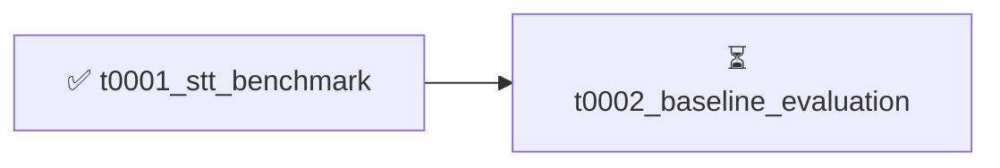

# Project Tasks

3 tasks. ⏳ **1 in_progress**, ✅ **2 completed**.

**Browse by view**: By status: [⏳ `in_progress`](by-status/in_progress.md), [✅
`completed`](by-status/completed.md); [By date added](by-date-added/README.md)

---

## Dependency Graph

---

## ⏳ In Progress

⏳ 0002 — <strong>Baseline Evaluation — Deepgram and Whisper Large v3 on
Gold-92</strong>

| Field | Value |
|---|---|
| **ID** | `t0002_baseline_evaluation` |
| **Status** | in_progress |
| **Effective date** | 2026-06-23 |
| **Dependencies** | [`t0001_stt_benchmark`](../../overview/tasks/task_pages/t0001_stt_benchmark.md) |
| **Expected assets** | 2 predictions |
| **Source suggestion** | — |
| **Task types** | [`stt-benchmark-run`](../../meta/task_types/stt-benchmark-run/), [`baseline-evaluation`](../../meta/task_types/baseline-evaluation/) |
| **Start time** | 2026-06-23T08:04:26Z |
| **Task page** | [Baseline Evaluation — Deepgram and Whisper Large v3 on Gold-92](../../overview/tasks/task_pages/t0002_baseline_evaluation.md) |
| **Task folder** | [`t0002_baseline_evaluation/`](../../tasks/t0002_baseline_evaluation/) |

# Baseline Evaluation — Deepgram and Whisper Large v3 on Gold-92

## Motivation

Before pursuing entity-aware post-correction or fine-tuning, the project needs a reliable
reference point for all five registered metrics on both the production STT system and the
leading open-source alternative. This task produces the baseline results against which every
subsequent improvement is judged. Without this baseline, no downstream task can claim a
statistically significant improvement.

The gold-92 benchmark (`stt-benchmark-gold-92`, produced by `t0001_stt_benchmark`) contains 93
annotated WAV clips from Rezolve production voice sessions across the investor-relations
domain, with accented English speakers. It is the held-out evaluation set for all tasks in
this project.

## Runs

This task evaluates exactly two STT configurations:

1. **Deepgram Nova-2** — the current Rezolve production STT endpoint. Called via the Deepgram
   cloud API with the `nova-2` model and default settings (no custom vocabulary). This is the
   production baseline the project is trying to beat.

2. **Whisper Large v3** — the state-of-the-art open-source STT model from OpenAI. Run via the
   `openai-whisper` Python package (local inference, CPU or GPU). No fine-tuning or prompt
   injection; pure out-of-the-box transcription. This provides the open-source ceiling before
   any domain adaptation.

No other STT systems or model variants are evaluated in this task.

## Metrics

All five registered project metrics must be computed for both runs:

* `entity_accuracy_gold92` — accuracy on action-critical entity spans (brand names, product
  lines, SKUs, IR terms) after normalisation. Primary success metric.
* `wer_gold92` — full-transcript WER over all reference words.
* `action_critical_wer_gold92` — WER restricted to action-critical token spans only.
* `intent_preservation_gold92` — fraction of utterances where predicted transcript preserves
  the ground-truth intent (action type + primary slot agreement).
* `latency_p50_seconds` — p50 end-to-end latency from speech-end to transcription complete.

For each metric, compute BCa bootstrap 95% confidence intervals (n=10,000 resamples, paired
samples). Run a paired BCa bootstrap significance test comparing Whisper Large v3 vs Deepgram
on `entity_accuracy_gold92` (the primary metric).

## Data Handling

* DVC-pull the gold-92 audio from `tasks/t0001_stt_benchmark/` before running any inference.
* Ground-truth transcripts and entity annotations are in the same DVC-tracked folder.
* Do not modify or augment the gold-92 data — it is a held-out regression set.
* Save raw transcription outputs (pre-metric-computation) to `data/` within this task for
  reproducibility:
  * `data/deepgram_transcripts.json` — raw Deepgram API responses for all 93 clips
  * `data/whisper_transcripts.json` — raw Whisper outputs for all 93 clips

## Compute and Budget

* **Deepgram Nova-2**: API call cost is approximately $0.0043/minute of audio. Gold-92 is
  roughly 15–20 minutes total, so ~$0.09. Negligible.
* **Whisper Large v3**: local inference on CPU takes ~8–12 min/clip × 93 clips ≈ 12–19 hours.
  Use a GPU instance if available (A100/H100: ~2–5 minutes total). Prefer a GPU if wall-clock
  time matters; the per-task budget is $100.
* Total budget estimate: $5–$20 (GPU instance) + ~$0.09 (Deepgram API). Well within limit.

If GPU is used, include `setup-machines` and `teardown` steps.

## Output Assets

Two predictions assets, one per STT system:

* `predictions/deepgram-nova2-gold92` — raw transcripts + per-utterance metrics for Deepgram
* `predictions/whisper-large-v3-gold92` — raw transcripts + per-utterance metrics for Whisper

Each predictions asset includes:

* `predictions.json` — one entry per clip: `clip_id`, `hypothesis`, `reference`,
  `entity_spans_predicted`, `entity_spans_reference`, per-utterance metric values
* `metadata.json` — model name, API version or package version, inference date, total latency

## Charts and Tables

**Required charts** (save to `results/images/`, embed in `results_detailed.md`):

1. Bar chart comparing `entity_accuracy_gold92`, `wer_gold92`, and
   `action_critical_wer_gold92` for both systems side-by-side, with BCa 95% CI error bars.
   Caption: "Figure 1: Primary metric comparison — Deepgram Nova-2 vs Whisper Large v3 on
   gold-92."
2. Per-utterance scatter plot of entity accuracy (x = Deepgram, y = Whisper), one point per
   clip, coloured by speaker accent group. Caption: "Figure 2: Per-utterance entity accuracy
   correlation — clips above diagonal favour Whisper."

**Required tables** (in `results_detailed.md`):

1. Summary metrics table: rows = {Deepgram Nova-2, Whisper Large v3}, columns = all 5 metrics
   (point estimate ± 95% CI).
2. Per-accent-group breakdown: rows = accent groups, columns = `entity_accuracy_gold92` for
   each system.

## Key Research Questions Addressed

1. What is the current WER and entity accuracy of Deepgram (production) and Whisper Large v3
   on the gold-92 benchmark, broken down by utterance category and entity type? *(RQ1)*
2. Does Whisper Large v3 materially outperform Deepgram on entity accuracy with statistical
   significance (BCa p < 0.05)? *(Sub-question of RQ1)*

## Dependencies

* `t0001_stt_benchmark` — provides the gold-92 DVC-tracked audio and ground-truth annotations.
  This task cannot start without the dataset being available via `dvc pull`.

## Cross-References

* Project description: "What is the current WER and entity accuracy of Deepgram (production)
  and Whisper Large v3 on the gold-92 benchmark?" (RQ1)
* Deepgram Nova-2 documentation — current production STT endpoint
* Radford et al. (2023) — Whisper model paper

## ✅ Completed

✅ 0003 — <strong>Literature Review: Entity-Aware STT for Ecommerce Voice
AI (Jan–Jun 2026)</strong>

| Field | Value |
|---|---|
| **ID** | `t0003_literature_review_entity_stt` |
| **Status** | completed |
| **Effective date** | 2026-06-23 |
| **Dependencies** | — |
| **Expected assets** | 10 paper |
| **Source suggestion** | — |
| **Task types** | [`literature-survey`](../../meta/task_types/literature-survey/) |
| **Start time** | 2026-06-23T08:06:23Z |
| **End time** | 2026-06-23T09:25:00Z |
| **Step progress** | 11/15 |
| **Task page** | [Literature Review: Entity-Aware STT for Ecommerce Voice AI (Jan–Jun 2026)](../../overview/tasks/task_pages/t0003_literature_review_entity_stt.md) |
| **Task folder** | [`t0003_literature_review_entity_stt/`](../../tasks/t0003_literature_review_entity_stt/) |
| **Detailed report** | [results_detailed.md](../../tasks/t0003_literature_review_entity_stt/results/results_detailed.md) |

# Literature Review: Entity-Aware STT for Ecommerce Voice AI (Jan–Jun 2026)

## Motivation

Rezolve's voice commerce assistant currently uses Whisper Turbo with dynamic context injection
(a runtime hotword list passed to the decoder) as its production STT pipeline. The primary
bottleneck, confirmed by the gold-92 benchmark (`t0001_stt_benchmark`), is entity accuracy:
brand names, product names, and SKUs are frequently mangled or dropped, leading to
wrong-action rates that exceed the 2% target.

Before investing engineering effort in a new approach, this task surveys the most recent
published literature (January–June 2026) to identify which techniques offer the best
entity-accuracy gains in the ecommerce domain while remaining compatible with the project's
800 ms p50 latency constraint. The findings will directly inform the design of follow-on
benchmark and model tasks.

## Research Question

What are the most effective techniques published between January and June 2026 for improving
STT accuracy on domain-specific named entities (brand names, product names, SKUs), and which
of these are compatible with a sub-800 ms voice-to-action latency requirement in an English
ecommerce voice AI context?

## Scope

### Techniques to cover

1. **Contextual biasing** — runtime entity lists fed to the decoder (prefix trees, WFST
   rescoring, shallow biasing networks). This is the approach used in our current Whisper
   Turbo pipeline; the survey must identify state-of-the-art alternatives and their reported
   gains over this baseline.
2. **Shallow fusion** — interpolating ASR decoder scores with a domain language model at
   inference time. Focus on low-latency variants compatible with streaming ASR.
3. **Entity-aware ASR** — model architectures that embed entity knowledge during training or
   fine-tuning (named entity embeddings, entity-conditioned decoding, span-level objectives).
4. **LLM post-correction** — using a language model as a second-pass corrector of the ASR
   hypothesis, with or without entity grounding. Emphasis on latency-efficient approaches
   (speculative decoding, distilled correctors, prompt-based).

### Inclusions

- Papers published or posted between January 1 and June 30, 2026.
- English-language ASR or multilingual ASR with English results reported.
- Ecommerce, voice assistant, or general conversational domain.
- Any evaluation on named entity recognition accuracy, entity WER, or brand/product recall.

### Exclusions

- Papers published before 2026 (background reading only; do not add as task paper assets
  unless they are essential baselines cited by 2026 papers).
- Purely offline batch transcription systems with no latency data.
- Non-English-only systems with no English results.

## Approach

### Search strategy

Query the following databases using at least the keyword combinations listed below. Record
every query and its result count in `results/search_log.md`.

**Databases**: arXiv (cs.CL, cs.SD, eess.AS), Semantic Scholar, ACL Anthology, Interspeech
2026 proceedings (if published), ICASSP 2026 proceedings.

**Keyword combinations** (run all six):

1. `contextual biasing ASR named entity 2026`
2. `entity-aware speech recognition ecommerce 2026`
3. `shallow fusion ASR latency 2026`
4. `LLM post-correction ASR named entity 2026`
5. `domain-specific ASR brand product 2026`
6. `Whisper fine-tuning named entity ecommerce 2026`

### Paper selection

- Target: a minimum of 8 and a maximum of 15 papers added as paper assets.
- Prioritize papers that report: (a) entity-level accuracy or entity WER, (b) latency
  measurements or inference cost, and (c) ecommerce or voice assistant domain results.
- Papers that do not report latency data are still in scope if they address entity accuracy
  directly — note the omission explicitly in the synthesis.

### Asset creation

Use `/add-paper` for each selected paper to create a paper asset under
`assets/paper/<paper_id>/`. Use `/download_paper` to obtain PDF files where available. For
each paper, read the full text before writing the summary. Mark abstract-only summaries
explicitly in the paper asset when a PDF is unavailable.

## Comparison Against Current Approach

The synthesis document must include a dedicated section titled **"Comparison Against Whisper
Turbo + Dynamic Context Injection"** that addresses:

1. Which surveyed techniques report gains on entities over a runtime hotword-biasing baseline?
2. Which techniques are latency-compatible (sub-800 ms p50 for a ~5-second utterance) based on
   reported numbers or reasonable extrapolation?
3. Which techniques are practically implementable without full model retraining (i.e., can be
   applied to our existing Whisper Turbo checkpoint)?
4. For each viable candidate: what is the estimated entity accuracy uplift vs. the hotword
   baseline?

This comparison should yield a ranked shortlist of at most 3 techniques to prototype in
follow-on tasks.

## Expected Outputs

### Paper assets

- 8–15 paper assets under `assets/paper/`, each passing `verify_paper_asset.py` with no
  errors.
- Each paper summary states: technique category, claimed entity-accuracy gain, latency impact,
  and domain.

### Synthesis document (`results/results_summary.md`)

Organized as follows:

1. **Methodology** — search queries, databases, inclusion/exclusion criteria, total papers
   reviewed vs. selected.
2. **Findings by technique category** — one subsection per category (contextual biasing,
   shallow fusion, entity-aware ASR, LLM post-correction), summarizing the 2–4 most relevant
   papers and the consensus finding for each category.
3. **Comparison Against Whisper Turbo + Dynamic Context Injection** — see above.
4. **Shortlist for prototyping** — the top 1–3 techniques ranked by expected entity accuracy
   gain while respecting the <800 ms latency constraint.
5. **Gaps and uncertainties** — what the surveyed literature does not cover, and what
   assumptions underlie the shortlist ranking.

### Search log (`results/search_log.md`)

Records every query run, the database, the date, the result count, and the number of papers
selected from that query.

## Key Questions

1. Does contextual biasing (the technique underlying our current dynamic context injection)
   remain the dominant approach in Jan–Jun 2026 literature, or have newer methods superseded
   it?
2. Which post-correction approach offers the best entity accuracy gain with the lowest added
   latency?
3. Is shallow fusion still competitive with end-to-end entity-aware ASR architectures for
   ecommerce domains?
4. Are there ecommerce-specific benchmarks published in this period that could complement
   gold-92 for ongoing evaluation?

## Dependencies

No task dependencies. This is a pure literature survey and can start immediately. The gold-92
benchmark dataset (`t0001_stt_benchmark`) provides domain context but is not a runtime input
to this task.

## Budget and Compute

This task requires no GPU compute. Costs are limited to:

- LLM API calls for paper summarization: estimated $2–5 total.
- Web search and paper download: no direct cost.

No remote machine setup is needed.

**Results summary:**

> ---
> task_id: "t0003_literature_review_entity_stt"
> date: "2026-06-23"
> ---
> **Literature Review: Entity-Aware STT for Ecommerce Voice AI (Jan–Jun 2026)**
>
> **Summary**
>
> Systematic literature review of Jan–Jun 2026 publications on entity-aware STT. **15 paper
> assets**
> were created covering contextual biasing, entity-aware ASR architectures, and LLM
> post-correction.
> The top no-retraining candidates for prototyping on gold-92 are **RECOVER** (33–35% relative
> E-WER
> reduction, Earnings-21) and **Ron2026** (17% relative WER reduction via Whisper
> `initial_prompt`).
> Shallow fusion has effectively no 2026 literature — documented as a gap, not a search
> failure.
>
> **Metrics**
>
> * **Paper assets created**: **15** (all passing `verify_paper_asset.py`, 0 errors)
> * **Databases searched**: **9** (arXiv, Semantic Scholar, ACL Anthology, ICASSP 2026,
>   Interspeech
> 2026, Papers With Code, AssemblyAI, Emergent Mind, Google web search)
> * **Search queries run**: **14** (6 required keyword combinations + 8 gap-filling queries)

✅ 0001 — <strong>STT Benchmark — Gold-92 Dataset Ingestion</strong>

| Field | Value |
|---|---|
| **ID** | `t0001_stt_benchmark` |
| **Status** | completed |
| **Effective date** | 2026-06-22 |
| **Dependencies** | — |
| **Expected assets** | 1 dataset |
| **Source suggestion** | — |
| **Task types** | [`audio-dataset-curation`](../../meta/task_types/audio-dataset-curation/) |
| **Start time** | 2026-06-22T00:00:00Z |
| **End time** | 2026-06-22T00:00:00Z |
| **Step progress** | 6/6 |
| **Task page** | [STT Benchmark — Gold-92 Dataset Ingestion](../../overview/tasks/task_pages/t0001_stt_benchmark.md) |
| **Task folder** | [`t0001_stt_benchmark/`](../../tasks/t0001_stt_benchmark/) |
| **Detailed report** | [results_detailed.md](../../tasks/t0001_stt_benchmark/results/results_detailed.md) |

# STT Benchmark — Gold-92 Dataset Ingestion

## Objective

Ingest the gold-92 held-out STT benchmark dataset from Rezolve production voice sessions into
the ARF task structure, version the audio files with DVC, and register the dataset asset so
all future evaluation tasks can depend on it.

## Background

The gold-92 dataset was curated from Rezolve production brainpowa-realtime-api sessions. It
contains 93 WAV clips annotated with manually verified ground-truth transcripts plus existing
Deepgram Nova-2 and Whisper Large v2 hypotheses. Speakers include accented English (French,
German, Hebrew, Korean, Russian, Spanish native languages) and English-native Rezolve
investor-relations recordings.

This dataset is the primary held-out regression set for all STT experiments in this project.
It must never be used for training or fine-tuning — only for evaluation.

## What Was Done

- Copied 93 WAV clips from the local benchmark directory
  (`tmp/stt-research/bencmark-92/gold_combined/`) into
  `tasks/t0001_stt_benchmark/assets/dataset/stt-benchmark-gold-92/files/audio/`.
- Created `gold_set.jsonl` (93 records) with full annotation schema: clip_id, source,
  filename, ground_truth, production (Deepgram), whisper.
- Created `ground_truth.jsonl` (93 records) with simplified clip_id + ground_truth index.
- Tracked the `audio/` directory with DVC (`dvc add`) pointing to the Azure Blob remote
  `azure://ml-dvc-datasets/datasets/rail-arf-stt`.
- Committed the `.dvc` pointer file to git; actual audio bytes go through `dvc push`.

## Constraints

- Gold-92 is **held-out only**. Never split into train or validation. Never fine-tune on it.
- Audio files are DVC-managed — do not commit raw WAV bytes to git.
- The `audio.dvc` pointer must be kept up to date if audio files change.

**Results summary:**

> **Results Summary: t0001_stt_benchmark**
>
> **Outcome**
>
> Gold-92 STT benchmark dataset successfully ingested and registered. 93 WAV clips with
> ground-truth annotations are now version-controlled: JSONL files in git, audio in DVC
> (Azure Blob Storage at `azure://ml-dvc-datasets/datasets/rail-arf-stt`).
>
> **Assets Produced**
>
> * Dataset asset `stt-benchmark-gold-92` with 93 clips, 2 JSONL annotation files, and
>   DVC-tracked
> audio directory.
>
> **Baseline Observations (from gold_set.jsonl)**
>
> * Production (Deepgram) transcripts are present for all 93 clips.
> * Whisper Large v2 transcripts are present for all 93 clips.
> * Formal WER and entity accuracy evaluation is deferred to `t0002_baseline_evaluation`.
>
> **Next Steps**

