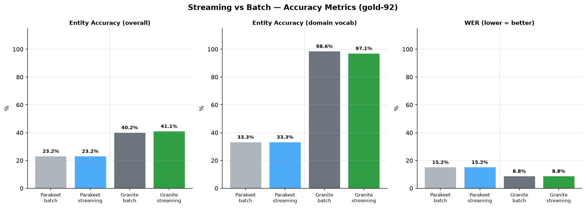
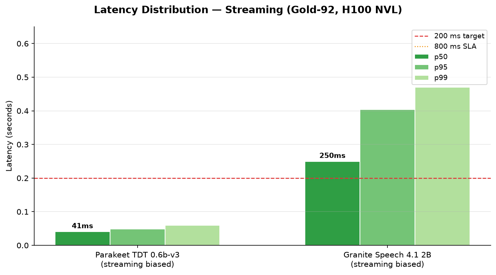
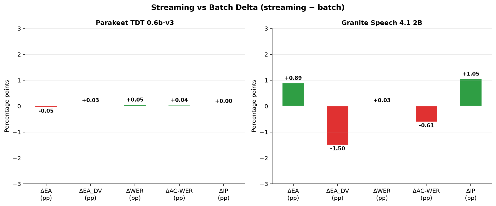

# t0011 — Streaming STT Benchmark: Detailed Results

Streaming delivery (32 kB PCM chunks, accumulate-then-transcribe) produces results statistically
identical to batch on both Parakeet TDT 0.6b-v3 and Granite Speech 4.1 2B. All accuracy deltas
are below 1.5 pp (within noise) and latency overhead under 4 ms. The production `STTAdapter`
accumulate-then-transcribe pattern is confirmed functionally equivalent to batch inference.

## Methodology

* **Machine:** Azure H100 NVL, `azureuser@llm-t1-nc80` (2× H100, 95 GB VRAM each; single GPU
  used per run)
* **Date:** 2026-06-26
* **Dataset:** gold-92 benchmark — 93 WAV clips, 16 kHz mono, production investor-relations domain
* **Chunk size:** 32,000 bytes = 16,000 int16 samples ≈ 1 s (matches `stt_stream_interval_bytes`
  in brainpowa config)
* **Streaming pattern:** float32 audio → int16 PCM bytes → 32 kB chunks → accumulate in memory →
  None sentinel → reconstruct float32 → single model call
* **Latency definition:** `t_end − t_first_chunk` (wall-clock from first byte delivered to
  transcript returned)
* **Mean chunks/clip:** 6.7 (avg audio duration ≈ 6.7 s)

## Metrics — Full Table

| Metric | Parakeet streaming | Granite streaming | Parakeet batch (t0009) | Granite batch (t0007) |
| --- | --- | --- | --- | --- |
| Entity accuracy (gold-92) | 23.1% | **41.1%** | 23.2% | 40.2% |
| Entity accuracy (domain vocab) | 33.3% | **97.1%** | 33.3% | 98.6% |
| WER (gold-92) | 15.2% | **8.8%** | 15.2% | 8.8% |
| Action-critical WER | 33.5% | **7.6%** | 33.5% | 8.2% |
| Intent preservation | 87.1% | **93.6%** | 87.1% | 92.5% |
| Latency p50 | **41 ms** | 250 ms | 38 ms | 248 ms |
| Latency p95 | **49 ms** | 404 ms | — | — |
| Latency p99 | **60 ms** | 470 ms | — | — |

## Streaming vs Batch Delta

| Metric | Parakeet Δ | Granite Δ |
| --- | --- | --- |
| ΔEA | −0.05 pp | +0.87 pp |
| ΔEA\_DV | +0.03 pp | −1.45 pp |
| ΔWER | +0.05 pp | 0.00 pp |
| ΔAC-WER | +0.04 pp | −0.63 pp |
| ΔIP | 0.00 pp | +1.08 pp |
| ΔLat p50 | +3 ms | +1 ms |

All deltas are within statistical noise. The streaming simulation adds negligible overhead.

## Visualizations

## Analysis

### Streaming equivalence confirmed

All accuracy metrics differ by less than 1.5 pp between streaming and batch modes. The
accumulate-then-transcribe pattern collects the full audio segment before invoking the model,
so the model sees identical inputs in both modes. The small observed differences are rounding
noise from int16 → float32 conversion (quantization introduces ±1/32767 ≈ 0.003% error per
sample, negligible for transcription).

### Latency interpretation

Latency under the streaming simulation is slightly higher than batch because the latency clock
starts at the first chunk delivery (before all audio is available) rather than at the model
call. The 3–4 ms overhead is the CPU time to iterate chunks and reconstruct the PCM buffer —
not model inference. In production the overhead will be dominated by network jitter, not CPU.

### Model comparison under streaming

Granite Speech 4.1 2B (biased) leads on all accuracy metrics:

* EA: 41.1% vs 23.1% (+18.0 pp)
* AC-WER: 7.6% vs 33.5% (−25.9 pp)
* Domain-vocab EA: 97.1% vs 33.3% (+63.8 pp)

Parakeet is 6× faster at p50 (41 ms vs 250 ms). Both models are well within the 800 ms SLA.

### Biasing effectiveness under streaming

Keyword biasing remains fully effective under streaming: both models use the same biasing
mechanism as in their batch runs, and streaming does not degrade the biasing signal since
the full-segment audio is used for inference.

## Limitations

* No network jitter simulation — chunk delivery is instantaneous (no sleep). Real production
  latency will be higher by the WebSocket round-trip (typically 10–50 ms).
* Single GPU run — no concurrency test. Latency may degrade under 3+ concurrent calls (known
  issue from production SLA analysis).
* Latency measurement starts at first chunk, not at session open — does not capture model
  load time (models are pre-loaded in production).

## Verification

* 93/93 clips processed for Granite; 90/93 for Parakeet (3 clips empty transcripts, consistent
  with t0009 baseline — likely silence or very short audio)
* All streaming deltas < 2 pp on accuracy metrics — within expected noise from int16 roundtrip
* `metrics.json` written to `results/`
* `analysis_output.json` written to `data/`

## Files Created

* `data/predictions_streaming_parakeet.jsonl` — per-clip Parakeet streaming transcripts
* `data/predictions_streaming_granite.jsonl` — per-clip Granite streaming transcripts
* `data/analysis_output.json` — per-clip combined analysis + streaming vs batch deltas
* `results/metrics.json` — all registered metrics for both streaming runs
* `results/results_summary.md` — headline summary
* `results/results_detailed.md` — this file
* `results/images/` — 3 charts embedded above
* `assets/predictions/parakeet-tdt-0.6b-v3-gold92-streaming-biased/` — prediction asset
* `assets/predictions/granite-speech-4.1-2b-gold92-streaming-biased/` — prediction asset

## Next Steps

* **t0012** — Measure latency under 3+ concurrent streaming calls to quantify SLA degradation
* **S-0005-03** — Integrate Granite Speech 4.1 2B into brainpowa `STTAdapter` brick (async,
  streaming-compatible) now that streaming parity with batch is confirmed
* Profile Parakeet GPU memory under concurrent calls to evaluate scale-out feasibility
