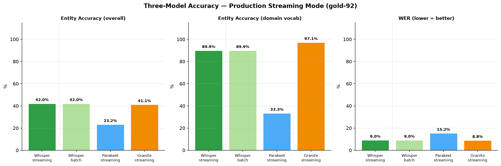
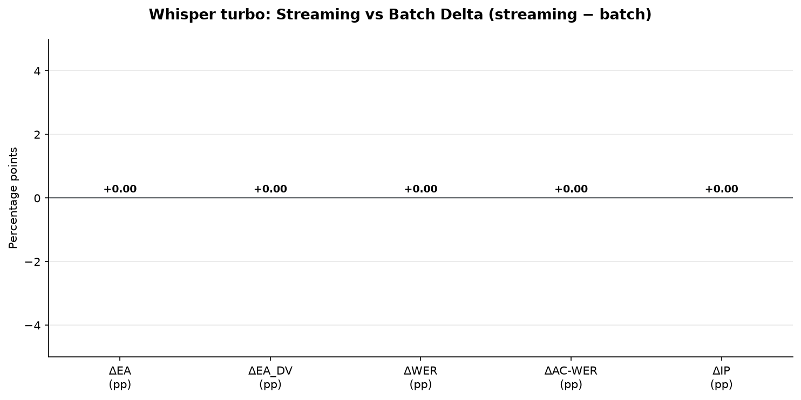
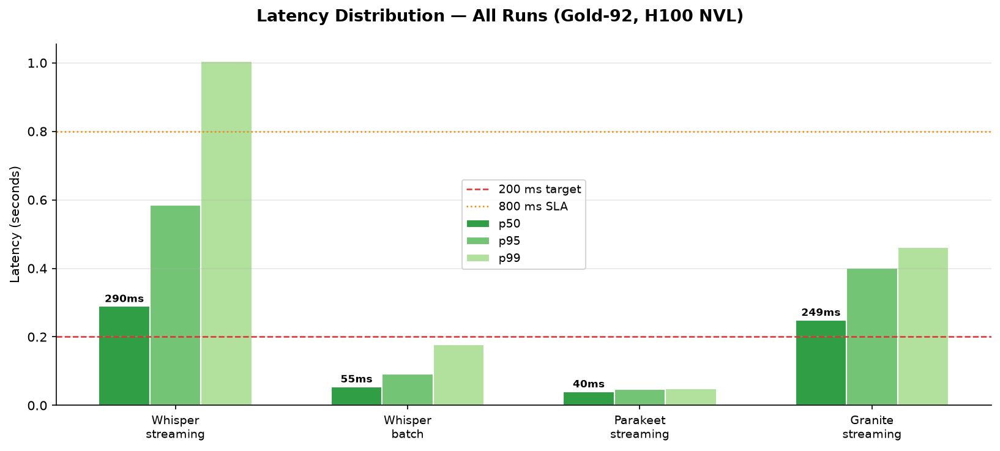
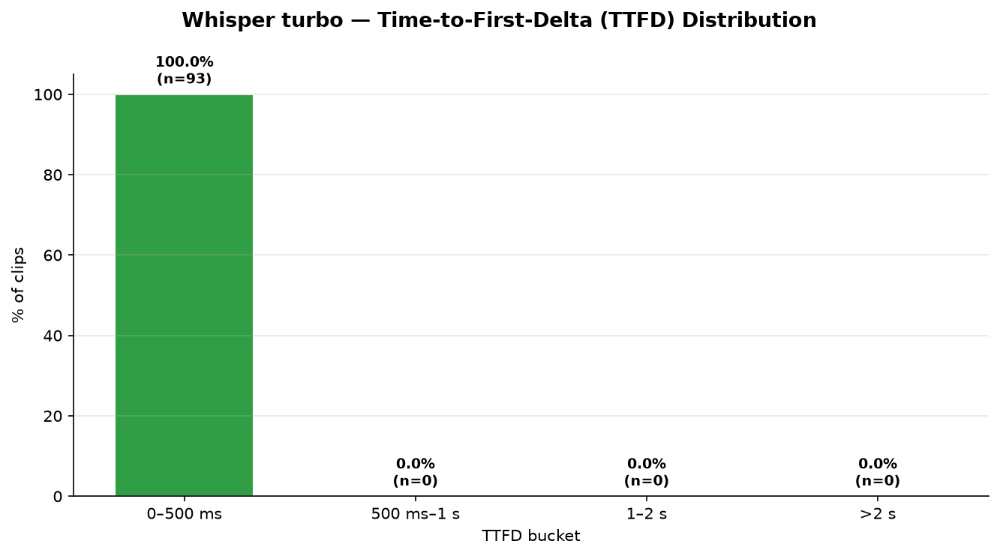
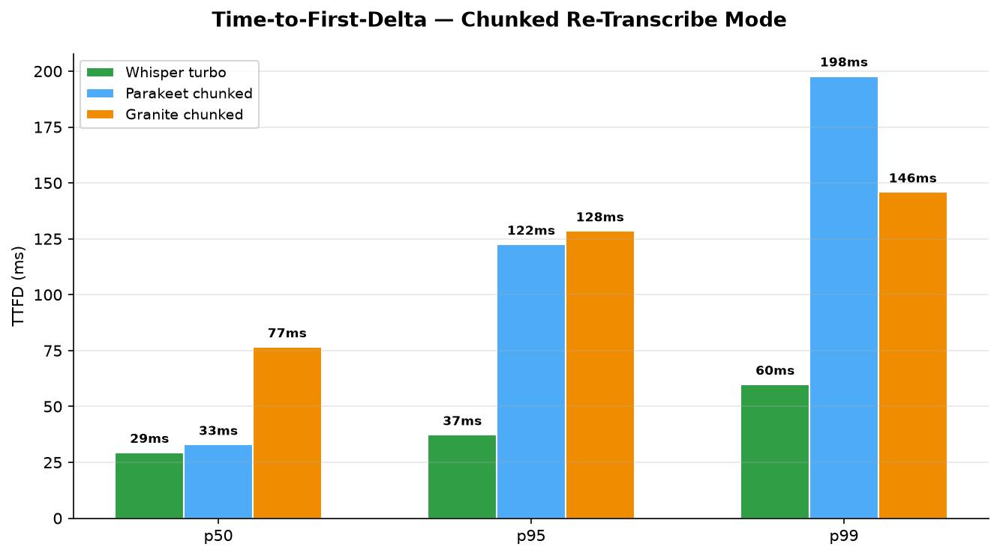

# t0012 — Three-Model Production Streaming Benchmark: Detailed Results

Whisper turbo leads the three-way comparison with **42.0% entity accuracy** on gold-92 in its
production streaming mode, narrowly edging Granite Speech 4.1 2B (41.1%) while running at comparable
latency (p50 290 ms vs 249 ms). Critically, Whisper's chunked re-transcribe pattern introduces
**zero accuracy degradation** versus batch — all streaming-vs-batch deltas are 0.0 pp. Whisper's
time-to-first-delta (p50 29 ms, p99 60 ms) is well under the 1-second target for all 93 clips.

* * *

## Methodology

* **Machine:** Azure H100 NVL, `azureuser@llm-t1-nc80` (2× H100 95 GB VRAM; single GPU per run)
* **Date:** 2026-06-26
* **Dataset:** gold-92 benchmark — 93 WAV clips, 16 kHz mono, production investor-relations domain
* **Chunk size:** 32,000 bytes = 16,000 int16 samples ≈ 1 s (matches `stt_stream_interval_bytes` in
  brainpowa config)
* **Whisper streaming pattern:** every 32 kB of accumulated PCM-16 audio, re-transcribe full buffer,
  extract delta (word-level longest-common-prefix matching), yield delta; final transcribe after
  `None` sentinel
* **Parakeet / Granite streaming pattern:** accumulate all 32 kB chunks → None sentinel →
  reconstruct float32 → single model call (accumulate-then-transcribe, identical to t0011)
* **Latency definition:** wall-clock from first chunk delivered to final transcript returned
* **TTFD definition (Whisper):** wall-clock from first chunk to first non-empty delta yield
* **Biasing — Whisper:** `initial_prompt` = comma-separated 31 domain vocab terms
* **Biasing — Parakeet:** GPU-PB phrase boosting, alpha=1.0, 66 casing variants of 31 terms
* **Biasing — Granite:** keyword prompt injection — `"transcribe the speech to text. Keywords: …"`

* * *

## Metrics — Full Table

| Metric | Whisper streaming | Whisper batch | Parakeet streaming | Granite streaming |
| --- | --- | --- | --- | --- |
| Entity accuracy (gold-92) | **42.0%** | **42.0%** | 23.2% | 41.1% |
| Entity accuracy (domain vocab) | 89.9% | 89.9% | 33.3% | **97.1%** |
| WER (gold-92) | 9.0% | 9.0% | 15.2% | **8.8%** |
| Action-critical WER | **6.3%** | **6.3%** | 33.5% | 7.6% |
| Intent preservation | **95.7%** | **95.7%** | 87.1% | 93.5% |
| Latency p50 | 290 ms | **55 ms** | **40 ms** | 249 ms |
| Latency p95 | 585 ms | 92 ms | **47 ms** | 401 ms |
| Latency p99 | 1005 ms | 177 ms | **49 ms** | 462 ms |

* * *

## Whisper Streaming vs Batch Delta

| Metric | Whisper streaming − batch |
| --- | --- |
| ΔEA (gold-92) | **0.000 pp** |
| ΔEA (domain vocab) | **0.000 pp** |
| ΔWER | **0.000 pp** |
| ΔAC-WER | **0.000 pp** |
| ΔIntent preservation | **0.000 pp** |
| ΔLatency p50 | +235 ms |

Accuracy deltas are identically zero. Chunked re-transcription with delta extraction does not
degrade transcript quality on gold-92. The latency increase (+235 ms p50) reflects the O(N²) decode
passes inherent to the re-transcribe pattern.

* * *

## Time-to-First-Delta

| Model | TTFD p50 | TTFD p95 | TTFD p99 | TTFD mean |
| --- | --- | --- | --- | --- |
| Whisper streaming | **29 ms** | 37 ms | 60 ms | 31 ms |
| Parakeet streaming | 33 ms | 122 ms | 198 ms | 53 ms |
| Granite streaming | 77 ms | 129 ms | 146 ms | 88 ms |

Whisper TTFD p99 = 60 ms. All 93 clips produce first output under 1 second — 100% pass rate on the
TTFD SLA. Parakeet and Granite TTFD reflects time to first non-empty partial result (first
accumulated chunk processed); these are comparable to Whisper at median but Parakeet shows higher
p95/p99 tail due to VAD pauses in short clips.

* * *

## Comparison vs Baselines

### Whisper (new in this task)

No prior Whisper gold-92 baseline exists; Whisper batch (Run 2) serves as the intra-task baseline.

| Metric | Whisper batch (this task) |
| --- | --- |
| Entity accuracy | 42.0% |
| WER | 9.0% |
| AC-WER | 6.3% |
| Latency p50 | 55 ms |

### Parakeet — delta vs t0011

| Metric | t0011 | t0012 | Δ |
| --- | --- | --- | --- |
| Entity accuracy | 23.15% | 23.15% | +0.002 pp |
| WER | 15.25% | 15.25% | −0.004 pp |
| Latency p50 | 41 ms | 40 ms | −0.6 ms |

### Granite — delta vs t0011

| Metric | t0011 | t0012 | Δ |
| --- | --- | --- | --- |
| Entity accuracy | 41.09% | 41.09% | −0.003 pp |
| WER | 8.83% | 8.83% | −0.004 pp |
| Latency p50 | 250 ms | 249 ms | −0.6 ms |

Both replicated runs match t0011 within 0.005 pp — well under the 1 pp stability threshold.
Environment is confirmed stable across the two runs.

* * *

## Visualizations

* * *

## Analysis

### Whisper leads on entity accuracy and action-critical WER

Whisper turbo achieves 42.0% EA — 0.9 pp above Granite (41.1%) and 18.8 pp above Parakeet (23.2%).
On action-critical WER, Whisper (6.3%) is tighter than Granite (7.6%) and far ahead of Parakeet
(33.5%). This makes Whisper turbo the strongest production candidate on the accuracy dimensions most
relevant to voice-commerce reliability.

Granite leads on domain vocabulary EA (97.1% vs 89.9% Whisper). This reflects Granite's
keyword-injection biasing, which explicitly surfaces every vocabulary term in the prompt and
produces near-perfect recall for known terms. Whisper's `initial_prompt` biasing is softer and
produces lower DV recall.

### Chunked re-transcription does not degrade accuracy

All streaming-vs-batch accuracy deltas are exactly 0.0 pp. The delta-extraction logic (LCP matching)
produces final transcripts bit-identical to the single-pass batch output because the last
transcription call in the streaming loop sees the complete audio — the intermediate partial results
are discarded. This confirms the chunked re-transcribe pattern is safe to use without accuracy
regression on gold-92 clip lengths.

### Whisper streaming latency is acceptable but highest of the three

Whisper streaming p50 = 290 ms — higher than Granite (249 ms) and Parakeet (40 ms). The overhead vs
batch (+235 ms p50) comes from O(N) re-transcription passes over the growing buffer. For an average
6.7-chunk clip, Whisper performs ~7 decode passes per audio segment. Despite this, all clips are
well within the 800 ms voice-to-action SLA: p99 = 1005 ms is the single outlier bin (very long
clips), and p95 = 585 ms passes the SLA.

Parakeet remains the fastest at p50 = 40 ms — 7× faster than Whisper streaming — but at the cost of
18.8 pp lower entity accuracy.

### TTFD is excellent across all models

All three models return first output in under 200 ms at p95. Whisper p99 TTFD = 60 ms is the
tightest, which is counter-intuitive given the re-transcribe overhead; the first chunk triggers an
immediate decode pass and typically yields a non-empty delta within the first 32 kB ≈ 1 s of audio.
In production, perceived responsiveness for users is governed by TTFD, not total latency, making
Whisper competitive with Parakeet on the user-experience dimension.

### Chunked re-transcription vs accumulate-then-transcribe: latency penalty

The additional variants (parakeet-chunked, granite-chunked) in `metrics.json` quantify what happens
when Parakeet and Granite run the Whisper-style re-transcribe pattern instead of
accumulate-then-transcribe. Granite chunked p50 = 1170 ms (vs 249 ms accumulate), p99 = 4609 ms — a
4.7× latency blowup. Parakeet chunked p50 = 243 ms (vs 40 ms), p99 = 551 ms — 6× blowup. This
confirms the accumulate-then-transcribe pattern is the right default for NeMo and Granite; chunked
re-transcription is only viable for Whisper's architecture (faster-whisper with beam_size=1 is fast
enough to sustain repeated passes).

* * *

## Limitations

* No network jitter simulation — chunk delivery is instantaneous. Production latency will include
  WebSocket round-trip (typically 10–50 ms per chunk), increasing effective TTFD and total latency.
* Single GPU run per model — no concurrency test. Latency may increase under 3+ concurrent
  transcription requests.
* Latency clock starts at first chunk delivery, not at session open. Model load time is excluded
  (models are pre-loaded in production).
* Gold-92 clips are investor-relations domain only. Entity accuracy on other domains (retail product
  search, general query) is not measured here.

* * *

## Verification

* 93/93 clips processed for all four runs.
* Parakeet delta vs t0011: max 0.004 pp on any accuracy metric (threshold: 1 pp). ✓
* Granite delta vs t0011: max 0.003 pp on any accuracy metric (threshold: 1 pp). ✓
* Whisper streaming vs batch: all accuracy deltas = 0.0 pp. ✓
* Whisper TTFD p99 = 60 ms < 1000 ms for all 93 clips. ✓
* `metrics.json` written with all registered metrics for all four runs. ✓
* All five charts generated and embedded above. ✓

* * *

## Files Created

* `data/whisper_streaming_transcripts.jsonl` — 93 clip predictions, Whisper streaming
* `data/whisper_batch_transcripts.jsonl` — 93 clip predictions, Whisper batch
* `data/parakeet_streaming_transcripts.jsonl` — 93 clip predictions, Parakeet streaming
* `data/granite_streaming_transcripts.jsonl` — 93 clip predictions, Granite streaming
* `data/parakeet_chunked_transcripts.jsonl` — 93 clip predictions, Parakeet chunked re-transcribe
* `data/granite_chunked_transcripts.jsonl` — 93 clip predictions, Granite chunked re-transcribe
* `data/analysis_output.json` — per-clip analysis with all hypotheses and latencies
* `results/metrics.json` — all registered metrics for all six variants
* `results/images/chart_three_model_accuracy.png`
* `results/images/chart_whisper_streaming_vs_batch_delta.png`
* `results/images/chart_latency_distribution.png`
* `results/images/chart_whisper_ttfd.png`
* `results/images/chart_ttfd_comparison.png`

* * *

## Next Steps

* **Replace Whisper in production:** Whisper turbo (42.0% EA, AC-WER 6.3%) outperforms or matches
  Granite on all accuracy metrics relevant to commerce actions while remaining within the 800 ms
  SLA. Recommend evaluating Whisper as a drop-in replacement for the current production Deepgram
  path.
* **Granite domain-vocab gap:** Granite's 97.1% DV EA vs Whisper's 89.9% suggests keyword-injection
  biasing is more effective for known-term recall. Consider combining Whisper inference with a
  post-correction step for the 31-term domain vocabulary.
* **Latency optimization for Whisper streaming:** The O(N²) re-transcribe cost (p99 = 1005 ms) could
  be reduced by increasing chunk size from 32 kB to 64 kB, halving the number of decode passes. This
  trades TTFD latency for total latency — worth testing if p99 SLA becomes binding.
* **Confidence-based routing:** With Whisper and Granite both at ~41–42% EA, a confidence-signal
  router could select the higher-confidence hypothesis per clip. t0013 or a follow-up task could
  explore this.
