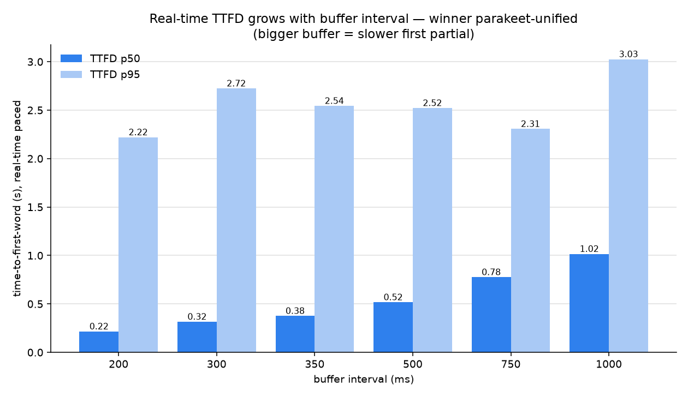
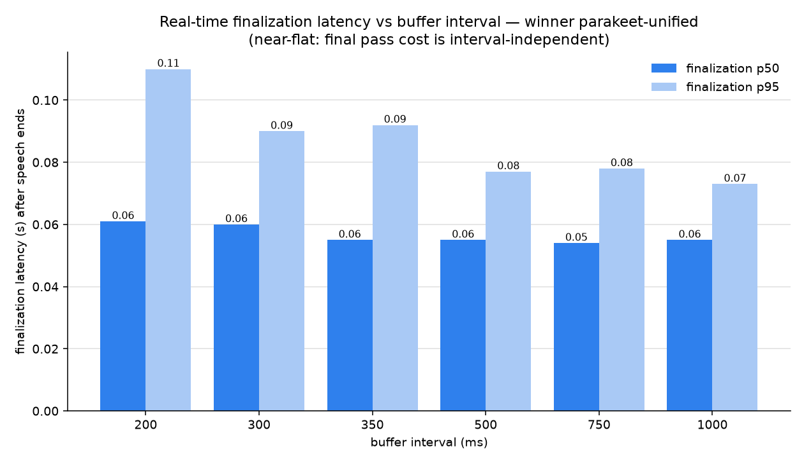

# t0017 — Buffer Interval, Real-Time Paced (correction to §5 of results_detailed.md)

**Separate report.** Does not replace `results_detailed.md` — it corrects the buffer-interval latency
finding using a real-time-paced measurement and a production ingress audit.

---

## 1. Why the original buffer-sweep latency was wrong

The compute-only sweep (`run_parakeet_buffer_sweep.py`, inherited from t0015) fed audio in **32768-byte
(~1s) delivery chunks** while triggering a re-transcribe when accumulated bytes ≥ `interval_bytes`.
Every interval we tested (200ms=6400B … 1000ms=32000B) is **smaller than one 32768B chunk**, so after
the first chunk `bytes_since_last (32768) ≥ interval` always fired → exactly **one transcribe per ~1s
chunk for all six intervals**. The interval never took effect below 1000ms; the 0.335–0.373s spread in
`results_detailed.md §5` is run-to-run noise, and "latency falls as the buffer grows" is a measurement
artifact (fewer passes over instantly-available audio), not a real-time effect.

## 2. Production ingress audit — sub-1s intervals ARE reachable in prod

Audit of `brainpowa-realtime-api` (evidence, file:line):

- Client audio enters via WebSocket `input_audio_buffer.append`, base64 PCM-16 decoded, arbitrary size
  (`protocol/handler.py:435-447`).
- The orchestrator **reframes to fixed 1024-byte (512-sample, 32ms) VAD frames** before the STT queue
  (`pipeline/orchestrator.py:946-952, 1102-1103`).
- `stt_stream_interval_bytes = 32000` (~1s) drives the re-transcribe cadence
  (`config.py:75`; `pipeline/stt/parakeet.py` accumulate-then-transcribe).

So production audio reaches STT in **1024-byte (32ms) frames**, not 1s chunks. The smallest effective
re-transcribe interval in prod is **~32ms (one VAD frame)**. Every tested interval (200–1000ms) is a
valid, reachable production config — the compute-only test simply modelled the ingress granularity
wrong (32768B instead of 1024B).

## 3. Real-time-paced measurement (the correct method)

`run_realtime_latency.py` delivers audio in **640-byte (20ms) frames at wall-clock real time** (close to
prod's 1024B/32ms), so the interval triggers at its true boundary. Metrics: **TTFD** (stream start →
first partial word), **finalization** (speaker stops → final transcript), **behind_realtime**
(backpressure). Winner `parakeet-unified-en-0.6b`, gold-92 subset (40 clips), GPU-PB biased.

| interval | TTFD p50 | TTFD p95 | finalization p50 | finalization p95 | max_behind p95 |
|:--:|:--:|:--:|:--:|:--:|:--:|
| **200ms** | **0.216s** | 2.22s | 0.061s | 0.110s | 0.062s |
| 300ms | 0.316s | 2.72s | 0.060s | 0.090s | 0.061s |
| 350ms | 0.376s | 2.54s | 0.055s | 0.092s | 0.062s |
| 500ms | 0.517s | 2.52s | 0.055s | 0.077s | 0.058s |
| 750ms | 0.776s | 2.31s | 0.054s | 0.078s | 0.057s |
| 1000ms (prod) | 1.016s | 3.03s | 0.055s | 0.073s | 0.058s |

Baseline `parakeet-tdt-0.6b-v3` @1000ms: TTFD p50 1.015s, finalization p50 0.030s, behind p95 0.024s.

## 4. What the real-time data shows

- **TTFD grows almost exactly linearly with the interval** (TTFD p50 ≈ interval + ~16ms): bigger buffer
  = slower first partial. This is the real behavior — the **opposite** of the compute-only artifact, and
  matches the intuition that a larger buffer means a longer fill-wait.
- **Finalization is flat and small (~55ms)** — the final pass cost is interval-independent; unified
  finalizes in ~55ms after the speaker stops (tdt ~30ms, cheaper decoder).
- **No backpressure**: `max_behind` p95 ≤ 62ms at every interval, incl. 200ms — the H100 keeps up even
  with the most frequent re-transcribes. Small buffers are safe.
- **Accuracy is unchanged** across intervals (identical final transcript — final pass sees the whole
  buffer regardless), so smaller buffers cost nothing in quality.
- TTFD p95 is noisy (2.2–3.0s), dominated by a few clips whose first partial fires late (short/quiet
  onsets); p50 is the reliable signal.

## 5. Corrected buffer recommendation

**Lower the production buffer from 1000ms toward ~300ms.** With unified:

- TTFD drops from ~1.0s → ~0.32s (**~3× more responsive** first partial),
- finalization stays ~55ms, accuracy identical,
- no backpressure (behind p95 ~61ms ≪ interval).

The only cost of a smaller buffer is **more re-transcribe passes per session** (higher GPU compute /
lower per-GPU session capacity) — a throughput/cost tradeoff, not a latency or quality one. Pick the
interval by capacity budget: **200–350ms for the most responsive UX** if GPU headroom allows, up to
~500ms as a compute-saving compromise. **1000ms (current prod) is the least responsive** and only
justified if GPU capacity is tight.

This supersedes the "keep 1000ms" line in `results_detailed.md §5` (which was based on the compute-only
artifact). The model-replacement verdict (unified > tdt) is unaffected — accuracy is interval-invariant.

## 6. Files (this report only)

- Real-time metrics: `results/metrics_realtime.json` (7 variants).
- Charts: `results/images/rt_ttfd_by_interval.png`, `results/images/rt_finalization_by_interval.png`.
- Predictions: `data/realtime_latency/{unified_{200,300,350,500,750,1000}ms,tdt_1000ms}.jsonl`.
- Run log: `logs/run_realtime.log`. Code: `code/run_realtime_latency.py`, `code/realtime_report.py`.
- Limitation: 40-clip subset (latency percentiles); 20ms frames vs prod's 32ms — both far below any
  interval, so the trend holds. Accuracy stays on the full 93 clips in `results/metrics.json`.
