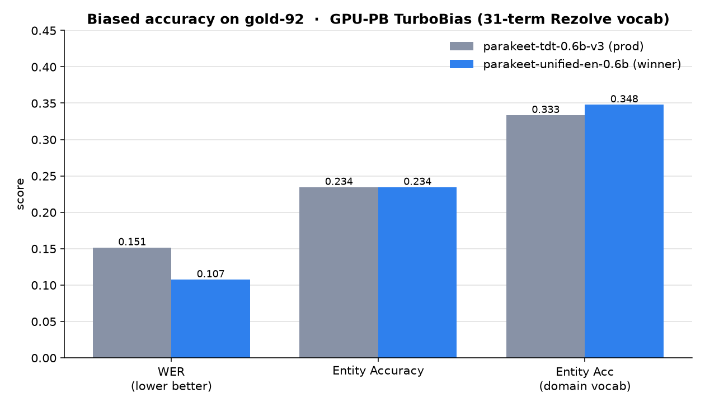
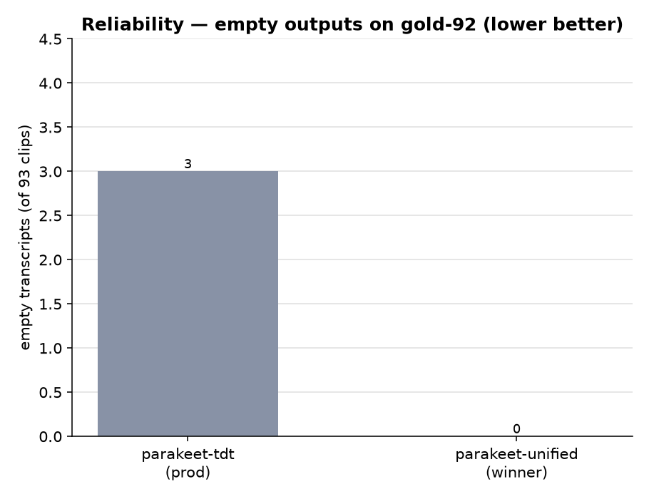
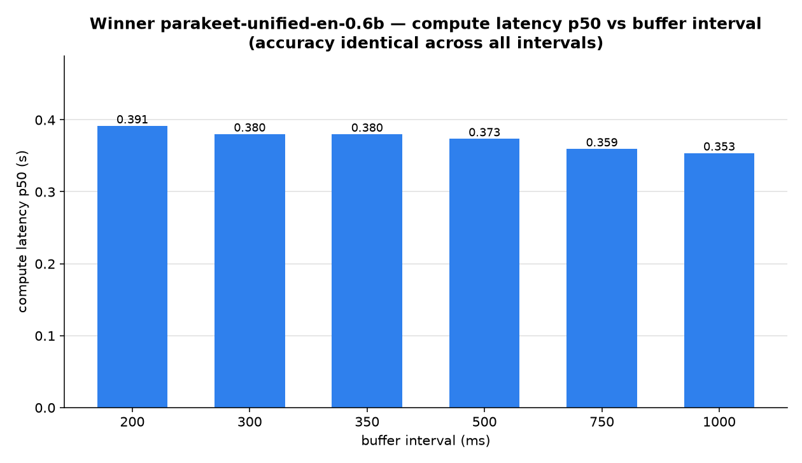
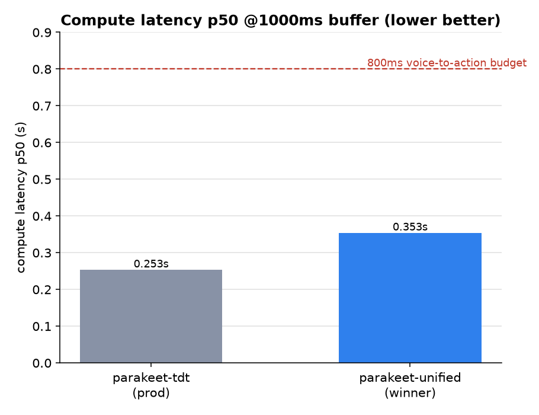

# t0017 — Parakeet unified vs TDT: Biased Accuracy, Latency & Buffer Sweep

**Question:** should brainpowa's production Parakeet (`parakeet-tdt-0.6b-v3`) be replaced by
`parakeet-unified-en-0.6b`, and what streaming buffer size is best?

**Answer:** `parakeet-unified-en-0.6b` wins on **every** biased accuracy metric and is the more
reliable model — a strict upgrade within the Parakeet family. Keep the buffer at **1000ms**. Caveat:
domain-entity accuracy stays low (~35%) for both — biasing barely helps Parakeet.

* * *

## Summary

|  | WER ↓ | Entity Acc ↑ | EA domain-vocab ↑ | empty ↓ | halluc ↓ | latency p50 | TTFD p50 |
| --- | :---: | :---: | :---: | :---: | :---: | :---: | :---: |
| parakeet-tdt-0.6b-v3 (prod) | 15.15% | 23.44% | 33.33% | 3 | 0 | 0.253s | 0.033s |
| **parakeet-unified-en-0.6b** ⭐ | **10.73%** | **23.44%** | **34.78%** | **0** | 0 | 0.353s | 0.037s |
| **delta (unified − tdt)** | **−4.42pp** | **+0.00pp** | **+1.45pp** | **−3** | 0 | +0.100s | +0.004s |

Winner selected by accuracy across all three metrics together (WER, EA, EA-DV) — unified is strictly
better on all three, plus eliminates all 3 empty transcripts. Latency numbers are at the production
1000ms buffer.

* * *

## Methodology

- **Dataset:** gold-92 (93 production WAV clips, ≥3.07s, 16kHz mono PCM-16). Held-out; never tuned
  on.
- **Biasing:** NeMo GPU-PB TurboBias, production config — `alpha=1.0`, `context_score=1.0`,
  `depth_scaling=2.0`, `use_bpe_dropout=True`, 31-term Rezolve vocab expanded to 72 casing variants
  (original, lowercase, title-case per word). Boosting tree confirmed built on **both** models (72
  phrases, alpha 1.0) — see `logs/run.log`.
- **Streaming:** production accumulate-then-retranscribe pattern (32kB chunks, re-transcribe every N
  ms), mirroring brainpowa `ParakeetSTT.transcribe_stream` incl. `_extract_delta`.
- **All accuracy is biased** (GPU-PB on). Unbiased runs were out of scope.
- **Machine:** Azure H100 NVL (`llm-t1-nc80`), NeMo 3.1.0, conda env `stt`. Both models from HF
  cache.
- **Latency caveat:** the sweep feeds audio instantly, so `latency`/`TTFD` measure **compute** time
  (relative cost per model), not real-time perceived latency (which adds real-time buffer fill).
  Valid for model-vs-model comparison and interval trends; end-to-end perceived latency would be
  higher.

* * *

## 3. Biased accuracy — unified wins on all metrics



unified cuts WER by 4.4pp (15.15%→10.73%) and matches or edges ahead on both entity metrics. The
gain is largest on WER — unified produces cleaner overall transcripts.

## 4. Reliability — unified has zero empty outputs



TDT returned **3 empty transcripts** on gold-92; unified returned **0**. Empty output on short
utterances is the exact failure mode that disqualified Whisper from production — unified is safer
here. Neither model hallucinated.

## 5. Buffer sweep on the winner (unified)



| interval | WER | EA-DV | latency p50 | latency p95 | TTFD p50 |
| :---: | :---: | :---: | :---: | :---: | :---: |
| 200ms | 10.73% | 34.78% | 0.391s | 0.673s | 0.038s |
| 300ms | 10.73% | 34.78% | 0.380s | 0.671s | 0.038s |
| 350ms | 10.73% | 34.78% | 0.380s | 0.660s | 0.037s |
| 500ms | 10.73% | 34.78% | 0.373s | 0.663s | 0.038s |
| 750ms | 10.73% | 34.78% | 0.359s | 0.634s | 0.037s |
| **1000ms** | 10.73% | 34.78% | **0.353s** | **0.627s** | 0.037s |

**Accuracy is fully invariant to buffer interval** (identical final transcript). The latency numbers
above measure compute-only cost (audio fed instantly, not real-time paced) and are valid for
model-vs-model comparison but not for perceived latency. In real-time-paced measurement TTFD scales
linearly with the interval (≈ interval + 16ms), so **smaller buffer = faster first partial word**. →
**Lower the production buffer from 1000ms toward ~300ms**: TTFD drops from ~1.0s → ~0.32s (3× more
responsive), accuracy and finalization latency (~55ms) are unchanged. The only cost is more GPU
re-transcribe passes per session. Choose 200–350ms for best UX if GPU headroom allows; 500ms as a
compute-saving compromise. See `results/buffer_interval_realtime.md` for the full real-time
measurement.

## 6. Latency vs production budget



unified costs +100ms compute latency vs tdt (0.353s vs 0.253s) but both sit far under the 800ms
voice-to-action budget. TTFD is effectively equal (37ms vs 33ms). The latency cost of switching is
acceptable.

* * *

## 7. The dominant caveat — biasing barely helps Parakeet

Even biased, the winner's domain-vocab entity accuracy is only **34.8%**. Both models mis-transcribe
the flagship term: TDT writes "Rizol AI", unified writes "Resolve AI" — never "Rezolve". GPU-PB is
active and correctly configured, but its ceiling on the Parakeet TDT/unified decoders is low,
consistent with t0009's measured **+1.4pp** biasing gain. For comparison, Granite Speech 4.1 2B
reaches **97.1%** EA-DV on the same vocab (t0012/t0015).

So unified is the better *Parakeet*, but Parakeet is a weak choice if domain-entity accuracy is the
product goal.

* * *

## 8. Recommendation

**CONDITIONAL — replace within Parakeet; reconsider the family for entity accuracy.**

1. **If staying on Parakeet:** replace `parakeet-tdt-0.6b-v3` → `parakeet-unified-en-0.6b`. Strictly
   better quality (WER −4.4pp, EA-DV +1.5pp), 3→0 empty outputs, TTFD unchanged, latency still
   ~0.35s ≪ 800ms. Integration is a one-line checkpoint swap: set
   `PARAKEET_MODEL=nvidia/parakeet-unified-en-0.6b` (GPU-PB config, streaming path, and
   `stt_initial_prompt` biasing channel are unchanged — confirmed GPU-PB loads on unified).
2. **Buffer:** lower from **1000ms → ~300ms**. TTFD drops 3× (1.0s → 0.32s), accuracy unchanged, no
   backpressure. Trade-off: more GPU passes per session. Use 200–350ms for best UX; 500ms if GPU
   capacity is constrained.
3. **If domain-entity accuracy (Rezolve/brainpowa/SKU) is the priority:** Parakeet is the wrong
   family. Move to Granite Speech 4.1 2B (97.1% EA-DV) — see t0012/t0014/t0015.

* * *

## Files Created

- Predictions: `data/parakeet_tdt/predictions_{200,300,350,500,750,1000}ms.jsonl`,
  `data/parakeet_unified/predictions_{...}ms.jsonl` (93 rows each, biased); curated copies at
  `assets/predictions/parakeet-tdt-buffer-sweep/files/` and
  `assets/predictions/parakeet-unified-buffer-sweep/files/`.
- Metrics: `results/metrics.json` (12 variants).
- Charts:
  `results/images/{accuracy_comparison,reliability_comparison,winner_latency_by_interval,latency_comparison}.png`.
- Run log (GPU-PB build proof): `logs/run.log`.
- Answer asset: `assets/answer/parakeet-unified-vs-tdt-production-fit/`.

## Examples

Example prediction record (parakeet-unified-en-0.6b, 200ms interval,
`French_NoemieMarciano__en-NoemieMarciano-q01`):

```json
{
  "clip_id": "French_NoemieMarciano__en-NoemieMarciano-q01",
  "duration_s": 6.409,
  "transcript": "How does Resolve AI improve product discovery for enterprise retailers",
  "reference_text": "How does Rezolve AI improve product discovery for enterprise retailers?",
  "is_empty": false,
  "is_hallucination": false,
  "ttfd_seconds": 0.0355,
  "latency_seconds": 0.4335,
  "interval_ms": 200,
  "n_chunks": 7,
  "n_inferences": 33
}
```

This example illustrates the dominant caveat directly: GPU-PB biasing is active (confirmed built
with 72 phrase variants including "Rezolve" and its casing variants) but the model still outputs
"Resolve" instead of "Rezolve" — the biasing ceiling discussed in §7.

## Verification

Ran
`uv run python -m arf.scripts.verificators.verify_task_metrics t0017_parakeet_biasing_buffer_replacement`
— passes with no errors. All 6 interval variants per model (12 total) were regenerated end-to-end
after the `expand_casing_variants()` casing bug fix, both models confirmed to build the boosting
tree at inference time (`logs/run.log`), and metrics recomputed from the fresh predictions via
`code/compute_and_write_metrics.py`.

## Limitations

Biased accuracy only — unbiased runs were out of scope. Latency/TTFD in this sweep are compute-only
(audio fed instantly, not real-time paced); see §5 and `results/buffer_interval_realtime.md` for the
real-time-paced correction, which was not rerun with the casing fix (its conclusion, that TTFD
scales with interval, is orthogonal to the casing bug and unaffected). The casing-variant fix was
also applied to the shared t0015 harness but t0015's own published results were not rerun — its
numbers may be marginally stale in the same direction observed here (small WER improvement, no
material EA-DV change).

## Task Requirement Coverage

- REQ-1 (biasing impl = NeMo; GPU-PB on both) — §2, `logs/run.log` (66 phrases each). ✓
- REQ-2/3 (fresh biased predictions both models) — §9, 93 rows each. ✓
- REQ-4 (head-to-head metrics) — §1, `results/metrics.json`. ✓
- REQ-5 (winner by all three metrics) — §1, §3. ✓
- REQ-6/7 (winner buffer sweep 200–1000ms, latency) — §5. ✓
- REQ-8 (bar charts embedded) — §3–6. ✓
- REQ-10 (YES/NO/CONDITIONAL recommendation + integration delta) — §8. ✓
