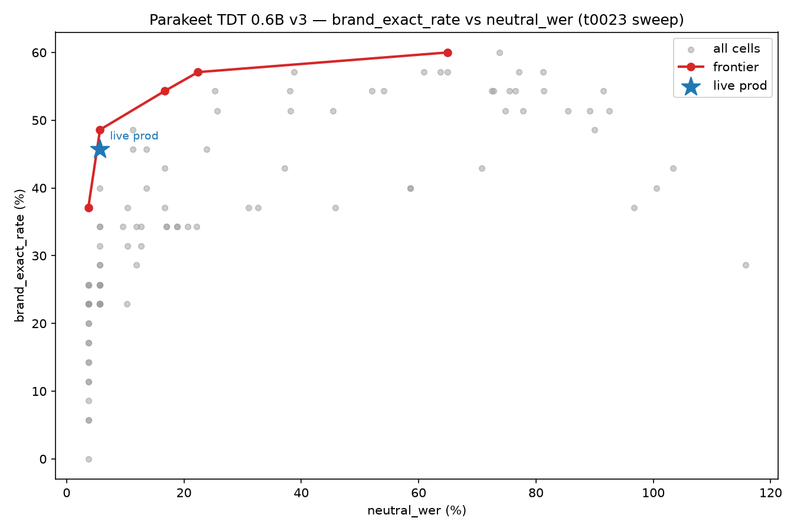
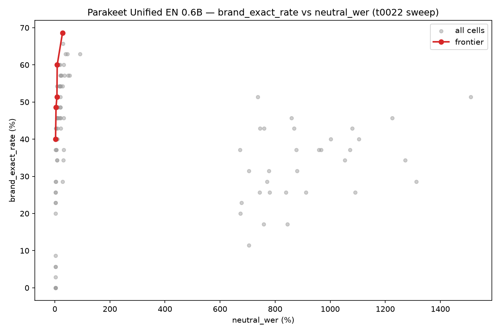

# Results Detailed: Biasing Pareto Re-Analysis + Biasing-on-Fine-Tune Ablation

## Summary

This task set out to do two self-contained things: (Part A) re-analyze the existing t0022/t0023
100-cell decoding-parameter sweeps to find the true `brand_exact_rate` vs `neutral_wer` Pareto
frontier for `parakeet-tdt-0.6b-v3` and `parakeet-unified-en-0.6b`, and check where the current
live-production decoding config sits relative to it; and (Part B) apply the tuned `malsd_batch`
boosting config on top of the existing t0021 fine-tuned checkpoint and evaluate on the 21-clip clean
production set, to determine whether biasing and fine-tuning are complementary or redundant. Part A
completed in full: the current live-prod TDT config is proven dominated, and this task recommends a
concrete zero-cost replacement (`context_score=2.5, depth_scaling=0.5, alpha=2.0`). Part B was
provisioned (a GPU VM, `FT-MC`, was acquired and fully verified) but never executed: the t0021
fine-tuned checkpoint and its `stt` conda environment do not exist on any machine reachable from
this project's current pool, a genuine data-provenance gap discovered mid-execution. Per an explicit
user decision, Part B was deferred rather than chased further, and `task.json`'s `expected_assets`
was reduced from `{"predictions": 1, "answer": 1}` to `{"answer": 1}` to match what this round
actually delivers.

## Methodology

**Part A (this task's only executed analysis)** ran entirely on the local machine hosting the
step-executor's worktree — no remote GPU, no new inference. It consumed two pre-existing files as
its sole inputs: `tasks/t0022_gpu_pb_diagnostic/results/param_sweep.jsonl` (100 rows,
`parakeet-unified-en-0.6b`) and `tasks/t0023_tdt_vs_unified_biasing/results/tdt_sweep.jsonl` (100
rows, `parakeet-tdt-0.6b-v3`). `code/pareto.py`'s `pareto_frontier()` computes the Pareto frontier
as a true O(n²) non-dominated-point filter over the pair `brand_exact_rate` (maximized) and
`neutral_wer` (minimized) — not a naive sort-and-scan, which both sweeps' `neutral_wer` ties would
cause to silently retain a dominated point. `select_frontier_cell()` then walks each frontier
ascending by `neutral_wer` and accepts a candidate as the new baseline only if it strictly increases
`brand_exact_rate` and its marginal ratio `Δneutral_wer / Δbrand_exact_rate` (against the current
baseline) is `<= 1.0`. `code/make_charts.py` rendered the two scatter+frontier PNGs. Step 9
(implementation) ran from `2026-08-13T10:53:51Z` to `2026-08-13T11:10:00Z` (≈16 minutes wall clock).

**Part B (provisioned, never executed)** ran through step 8 (setup-machines,
`2026-08-13T08:03:06Z`–`2026-08-13T10:52:32Z`). The pool's declared priority order
(`project/azure_vm.json`: `FT-NC80-v3` → `FT-NC80-v1` → `FT-NC80-v2` → `FT-MC`) found the first
three entries no longer exist in Azure (stale pool config); `FT-MC` (2x `NVIDIA H100 NVL`, 95.83 GB
GPU RAM each, 629 GB CPU RAM, CUDA 12.2, `eastus2`, `$13.96/hr`) was acquired and fully verified —
SSH reachable, GPU/CUDA confirmed via `nvidia-smi`/`nvcc`, repo rsynced (2238 files). The required
precondition for any Part B inference — the fine-tuned checkpoint at
`/mnt/finetune-checkpoints/parakeet-unified-finetuned-best.nemo` and the `stt` conda environment —
was absent from `FT-MC` and could not be located on any other reachable machine (full detail:
`intervention/checkpoint_not_found.md`). No inference ran. `FT-MC`'s Azure-side idle-shutdown
auto-stopped it at `2026-08-13T09:32:38Z` (`total_duration_hours: 1.0075`, `total_cost_usd: 14.06` —
see `results/costs.json`, `results/remote_machines_used.json`,
`logs/steps/008_setup-machines/machine_log.json`).

Task start: `2026-08-13T06:59:00Z`. This `results` step: started `2026-08-13T11:13:07Z`.

## Verification

* `meta.asset_types.answer.verificator` on
  `assets/answer/production-decoding-and-biasing-ft-verdict/` — **PASSED** (0 errors, 0 warnings),
  run in step 9 and independently confirmed by direct read of `short_answer.md`/`full_answer.md`.
* `verify_task_metrics.py` on `results/metrics.json` (`{}`) — **PASSED** (0 errors, 0 warnings), run
  in step 9.
* `ruff check`, `ruff format`, `mypy -p tasks.t0024_biasing_pareto_and_ft_biasing_ablation.code` on
  `code/paths.py`, `code/pareto.py`, `code/make_charts.py` — all clean, re-run independently in step
  9 (not just trusted from the implementation subagent's self-report).
* `verify_machines_destroyed.py` (wrapped in `run_with_logs.py`) — **PASSED** (0 errors, 0
  warnings), run in step 10; confirmed `machine_log.json`'s `destroyed_at`/`total_cost_usd` are
  finalized.
* Frontier correctness: this step-executor re-read `results/pareto_tdt.json` and
  `results/pareto_unified.json` directly (not just the implementation subagent's claim) and
  confirmed `len(frontier) == 5` for both models, matching `plan/plan.md`'s hand-derived expected
  composition exactly (see `## Approach` there), and matching the numbers reproduced in this file's
  tables below.

## Analysis

**Plan assumption check (required by the `results` step spec — the plan assumed Part B was feasible,
and that assumption was contradicted).** `plan/plan.md`'s `## Objective` and `## Approach` both
treat Part B as a routine, low-risk "one inference run, no training" reusing artifacts the plan
states are already confirmed present: `REQ-12` cites
`tasks/t0021_parakeet_finetune_vs_biasing/code/ paths.py` as evidence the checkpoint is "confirmed
present," and the plan's `## Risks & Fallbacks` table only anticipates a *decoding-compatibility*
risk (`apply_malsd_boost()` might raise or no-op on the fine-tuned checkpoint's decoder) — it does
not anticipate the checkpoint or its conda environment being **entirely unreachable**. That
assumption was contradicted in step 8: `paths.py` records where the checkpoint should be, but the VM
that actually produced/held it during t0021 no longer exists in the current Azure pool, and no DVC
tracking, backup, or export of the `.nemo` file exists anywhere in this repo. This is not a
decoding-compatibility failure as the plan anticipated — it is a more basic provenance failure the
plan's risk analysis did not cover. As a direct consequence, `REQ-12` through `REQ-21` (all of Part
B's core deliverables) are blocked this round, not merely delayed by a fixable bug. See
`intervention/checkpoint_not_found.md` for the full investigation record and
`## Cross-Step Decisions` in `checkpoint.md` for the user's deferral decision.

**Part A's frontier findings.** The current live-production TDT decoding config
(`context_score=3.0, depth_scaling=0.5, alpha=1.5`, `brand_exact_rate=45.7%`, `neutral_wer=5.7%`) is
**not** on the Pareto frontier — it is strictly dominated by
`context_score=2.5, depth_scaling=0.5, alpha=2.0` (`brand_exact_rate=48.6%` at the identical `5.7%`
`neutral_wer`), a zero-cost strict improvement already present in already-collected data. Both prior
tasks' "headline" cells (TDT `cs=3.0/ds=0.5/α=3.0`, unified `cs=2.5/ds=0.5/α=2.5`) are technically
Pareto-optimal (the last row of each frontier) but sit at an extreme, expensive tail — `64.9%` and
`27.9%` `neutral_wer` respectively, roughly 11x and 3x this task's selected cells' cost, for
comparatively little additional `brand_exact_rate`. Unified's frontier reaches a higher selected
`brand_exact_rate` (`60.0%`) at a lower `neutral_wer` (`8.7%`) than TDT does at any point below its
most expensive frontier cell, i.e. unified's frontier "knee" is qualitatively more favorable than
TDT's. Full derivation and both frontier tables: `results/frontier_tables.md`.

## Limitations

* **Part B is entirely unanswered this round.** `REQ-12` through `REQ-21` — loading the checkpoint,
  applying `malsd_batch` boosting, transcribing the clean-21 set, scoring, the 3-row comparison
  table, the `predictions` asset, and the complementary-vs-redundant verdict — are all blocked, not
  partially done. This is a genuine data-provenance gap (the VM that trained t0021's checkpoint no
  longer exists in the project's Azure pool, and the checkpoint is not DVC-tracked or otherwise
  backed up anywhere in this repo), not a decision to skip easy work. See
  `intervention/checkpoint_not_found.md` for the full search record and `checkpoint.md`'s
  `## Cross-Step Decisions` for the explicit user-approved deferral.
* **Part A's frontier is scoped to the existing 35-brand-clip / 10-neutral-clip subset of gold-92**
  that t0022's and t0023's 100-cell sweeps were run over (per `REQ-25`, Part A ran no new inference
  to re-derive the frontier on a larger sample).
* **`REQ-25`'s incidental latency-provenance correction did not execute.** `REQ-25` also flagged
  that the task-text-quoted fine-tuned-only clean-21 latency ("0.112s") is actually t0021's gold-92
  latency, and specified that the correct clean-21 p50 (≈0.0536s, hand-derived in `plan/plan.md`) be
  recomputed from t0021's raw per-clip data. That recomputation was planned as part of
  `build_comparison.py` in Part B's Milestone 3, which never ran because Part B was deferred — so
  the corrected clean-21 latency figure is not present in any file this task committed this round.
* **`REQ-26`/`REQ-27` are satisfied only for the code and analysis that actually shipped (Part A).**
  Part B's planned code (`constants.py`, `scoring.py`, `run_ft_biased_eval.py`, copying
  `apply_malsd_boost()` per `REQ-14`) was never written, so `REQ-26`'s "all reused code copied into
  `code/`" and `REQ-27`'s "latency recorded as a side metric on every relevant run" have nothing to
  point to on the Part B side this round.
* **`results/metrics.json` is `{}`.** None of the project's registered metrics
  (`entity_accuracy_gold92`, `wer_gold92`, `latency_p50_seconds`, etc. — all scoped to the full
  92-clip gold-92 benchmark) apply to Part A, which is pure re-analysis of already-collected sweep
  data over a 45-clip subset, not a new gold-92 evaluation run.
* **$14.06 of GPU spend produced no Part B deliverable.** `FT-MC` was fully provisioned and verified
  but never ran inference; this cost is reported honestly in `results/costs.json` as a sunk cost of
  the deferred Part B attempt, not hidden or amortized into Part A's (zero-cost) results.

## Visualizations

`pareto_tdt.png` — all 100 `parakeet-tdt-0.6b-v3` sweep cells plotted as `neutral_wer` (x) vs
`brand_exact_rate` (y), with the 5 non-dominated frontier cells highlighted and connected, and the
current live-production point (`cs=3.0/ds=0.5/α=1.5`, `45.7%@5.7%`) marked explicitly off the
frontier line. Key takeaway: the live-prod point sits strictly below/left of the frontier at its own
`neutral_wer` level, visually confirming it is dominated by `cs=2.5/ds=0.5/α=2.0` directly above it.

`pareto_unified.png` — all 100 `parakeet-unified-en-0.6b` sweep cells plotted the same way, frontier
highlighted, no live-prod marker (unified is not currently deployed). Key takeaway: the frontier
climbs to a higher `brand_exact_rate` (up to `68.6%`) than TDT's frontier ever reaches below its
most expensive cell, and the selected cell (`60.0%@8.7%`) sits well before the long, dominated tail
of points with `neutral_wer` well above 100% visible on the right of the plot (real ASR insertions
at extreme hyperparameter settings, not a plotting bug — see `results/frontier_tables.md`
`## Limitations`).

## Files Created

* `results/pareto_tdt.json`, `results/pareto_unified.json` — machine-readable frontier +
  selected-cell output of `code/pareto.py`, one per model.
* `results/frontier_tables.md` — full per-model frontier tables (sorted `neutral_wer` ascending,
  with deltas vs. live-prod for TDT), the selection stance, headline-cell-cost comparison,
  frontier-shape comparison, and Part-A-scope limitations.
* `results/images/pareto_tdt.png`, `results/images/pareto_unified.png` — scatter + frontier charts,
  embedded above.
* `results/metrics.json` — `{}` (no registered project metrics apply to Part A's re-analysis; see
  `## Limitations`).
* `results/costs.json` — `total_cost_usd: 14.06`, all from `FT-MC`'s deferred Part B provisioning.
* `results/remote_machines_used.json` — one entry, `FT-MC` (2x H100 NVL, 1.0075 hrs, $14.06).
* `assets/answer/production-decoding-and-biasing-ft-verdict/` (`details.json`, `short_answer.md`,
  `full_answer.md`) — the task's single `answer` asset (matches `task.json`
  `expected_assets.answer = 1`), stating Part A's production recommendation decisively and Part B's
  verdict as explicitly deferred.
* `intervention/checkpoint_not_found.md` — full record of the Part B blocker investigation.
* `code/paths.py`, `code/pareto.py`, `code/make_charts.py` — Part A's analysis code (Part B's
  planned code files were never written this round).

## Task Requirement Coverage

Quoting the operative task text from `task.json` (`short_description`) and the resolved
`task_description.md` (`## Objective`) verbatim:

> Re-analyze existing t0022/t0023 biasing sweeps for the brand-accuracy/WER tradeoff, then test
> biasing on top of the existing t0021 fine-tuned checkpoint.

> Two self-contained sub-tasks that both deliberately avoid the two most expensive levers available
> to this project right now — training a new model and collecting new held-out audio:
>
> 1. **Part A (zero compute):** re-analyze the param sweeps already collected in
>    [[t0022_gpu_pb_diagnostic]] and [[t0023_tdt_vs_unified_biasing]] to surface the full
>    `brand_exact_rate` vs `neutral_wer` tradeoff across the grid, not just the single
>    max-`brand_exact_rate` cell each prior task headlined. Locate the true Pareto frontier for both
>    `parakeet-tdt-0.6b-v3` and `parakeet-unified-en-0.6b`, and check where the current live
>    production decoding config actually sits relative to it.
> 2. **Part B (one inference run, no training):** apply the existing tuned `malsd_batch` boosting
>    config on top of the existing fine-tuned checkpoint from [[t0021_parakeet_finetune_vs_biasing]]
>    and evaluate on the existing 21-clip clean production eval set — answering whether biasing and
>    fine-tuning are complementary or redundant.

`task.json`'s `expected_assets` was reduced mid-execution (step 9, user-approved) from
`{"predictions": 1, "answer": 1}` to `{"answer": 1}` to reflect that Part B's `predictions` asset
will not ship this round.

`REQ-*` IDs below are reused from `plan/plan.md`'s `## Task Requirement Checklist`.

**Part A — core deliverables (all Done)**

| REQ | Requirement | Status | Answer / Result | Evidence |
| --- | --- | --- | --- | --- |
| REQ-1 | Compute full Pareto frontier for `parakeet-tdt-0.6b-v3` over all 100 rows of `tdt_sweep.jsonl` | Done | 5-cell frontier computed; see table in `results/frontier_tables.md` | `results/pareto_tdt.json`, `code/pareto.py` |
| REQ-2 | Compute the same frontier for `parakeet-unified-en-0.6b` over all 100 rows of `param_sweep.jsonl` | Done | 5-cell frontier computed | `results/pareto_unified.json`, `code/pareto.py` |
| REQ-3 | Plot `neutral_wer` vs `brand_exact_rate` scatter of all 100 cells per model, frontier highlighted, live-prod TDT point marked | Done | Two PNGs produced and embedded above | `results/images/pareto_tdt.png`, `results/images/pareto_unified.png` |
| REQ-4 | Locate the live-prod point relative to the TDT frontier | Done | Not on frontier; dominated by `cs=2.5/ds=0.5/α=2.0` (48.6%@5.7% vs. 45.7%@5.7%) | `results/pareto_tdt.json` `live_prod_on_frontier: false`, `live_prod_dominated_by` |
| REQ-5 | Write a production recommendation with an explicit numeric acceptable-regression stance | Done | Stance: accept a candidate only if `Δneutral_wer/Δbrand_exact_rate <= 1.0` vs. baseline; TDT recommendation `cs=2.5/ds=0.5/α=2.0`, unified `cs=3.0/ds=0.5/α=1.5` | `results/frontier_tables.md` `## Selection stance`, `assets/answer/.../full_answer.md` |
| REQ-6 | Answer: full Pareto frontier for TDT and unified | Done | Both 5-cell frontiers listed | `results/frontier_tables.md` |
| REQ-7 | Answer: is live-prod on the frontier; if not, which cell(s) dominate | Done | Not on frontier; dominated by `cs=2.5/ds=0.5/α=2.0` | `results/pareto_tdt.json` |
| REQ-8 | Answer: `neutral_wer` cost of each prior headline cell vs. the frontier | Done | TDT headline costs 64.9% (≈11x selected cell); unified headline costs 27.9% (≈3x selected cell) | `results/frontier_tables.md` `## Headline cell cost` |
| REQ-9 | Answer: does frontier shape differ qualitatively between models | Done | Unified reaches higher `brand_exact_rate` (60.0%) at lower `neutral_wer` (8.7%) than TDT's comparable range | `results/frontier_tables.md` `## Frontier shape comparison` |
| REQ-10 | Produce `pareto_tdt.png` and `pareto_unified.png` | Done | Both files exist (67.7 KB, 62.7 KB), embedded above | `results/images/pareto_tdt.png`, `results/images/pareto_unified.png` |
| REQ-11 | Frontier table per model, sorted by `neutral_wer` ascending, with deltas vs. live-prod | Done | Both tables present (TDT has delta columns; unified has no live-prod anchor per plan) | `results/frontier_tables.md` |

**Part B — core deliverables (all Not done — blocked, deferred)**

| REQ | Requirement | Status | Answer / Result | Evidence |
| --- | --- | --- | --- | --- |
| REQ-12 | Load the fine-tuned checkpoint `/mnt/finetune-checkpoints/parakeet-unified-finetuned-best.nemo` | Not done | Checkpoint absent on `FT-MC` and unreachable on any pool machine | `intervention/checkpoint_not_found.md`, `logs/steps/008_setup-machines/machine_log.json` |
| REQ-13 | Apply `change_decoding_strategy` with `malsd_batch` and Part A's selected unified frontier cell | Not done | Never attempted — no checkpoint to load | `intervention/checkpoint_not_found.md` |
| REQ-14 | Copy/adapt t0023's `apply_malsd_boost()` (not t0021's broken `apply_boosting()`) | Not done | Bug identified in step 6 research; fix never implemented since Part B never coded | `checkpoint.md` `## Cross-Step Decisions` (step 6 entry) |
| REQ-15 | Transcribe the same 21 clips as t0021's `manifest.jsonl` | Not done | No inference ran | `intervention/checkpoint_not_found.md` |
| REQ-16 | Compute `wer`, `ea_dv`, per-clip latency using t0021's scoring method | Not done | No transcripts produced to score | — |
| REQ-17 | Produce 3-row comparison table (biased-only, fine-tuned-only, fine-tuned+biased) | Not done | Third row's data was never generated | — |
| REQ-18 | Answer: does biasing improve EA-DV beyond 38.1%, esp. short/"brainpowa" clips | Not done | Explicitly deferred, not guessed | `assets/answer/.../full_answer.md` `## Synthesis` |
| REQ-19 | Answer: does boosting regress WER/latency vs. fine-tuned-only | Not done | Explicitly deferred | `assets/answer/.../full_answer.md` `## Synthesis` |
| REQ-20 | Answer: complementary or redundant | Not done | Explicitly deferred pending checkpoint resolution | `assets/answer/.../full_answer.md` `## Synthesis`, `## Limitations` |
| REQ-21 | Produce `predictions` asset: 21-row JSONL of fine-tuned+biased transcripts | Not done | No such asset exists; `task.json` `expected_assets` reduced accordingly | `task.json` (`expected_assets: {"answer": 1}`), `assets/predictions/` (empty, only `.gitkeep`) |

**Shared deliverable**

| REQ | Requirement | Status | Answer / Result | Evidence |
| --- | --- | --- | --- | --- |
| REQ-22 | Produce an `answer` asset covering both parts' recommendation/verdict | Done | Single shared answer asset states Part A's recommendation decisively and Part B's verdict as explicitly deferred (not fabricated) | `assets/answer/production-decoding-and-biasing-ft-verdict/` |

**Constraints (both parts, non-negotiable)**

| REQ | Requirement | Status | Answer / Result | Evidence |
| --- | --- | --- | --- | --- |
| REQ-23 | No new model fine-tuning of any kind | Done | Nothing was trained this round | No training code/logs exist anywhere in `code/` or `logs/` |
| REQ-24 | No expansion/modification of the 21-clip clean eval set | Done | The set was never touched this round (Part B never ran) | `tasks/t0021_parakeet_finetune_vs_biasing/data/clean_eval/` unmodified — no diff in this task's commits |
| REQ-25 | Part A must not run new inference; document unanswerable questions as limitations instead | Partial | Core constraint honored — Part A ran zero new inference; but the incidental latency-provenance correction this REQ also specified (recomputing clean-21 p50 ≈0.0536s from t0021's raw data) never executed, since it lived in Part B's deferred `build_comparison.py` | `## Limitations` above; `code/pareto.py`/`code/make_charts.py` (read-only sweep-file consumption, no inference calls) |
| REQ-26 | All reused code copied into `code/`, never imported cross-task | Partial | Satisfied for Part A's shipped code (`paths.py`, `pareto.py`, `make_charts.py` are self-contained, no cross-task imports); Part B's planned copy of `apply_malsd_boost()` was never written | `code/` directory listing above |
| REQ-27 | Quality-first: latency recorded as a side metric, never gates recommendation | Partial | Trivially honored for Part A (no latency dimension involved — frontier selection compares only `neutral_wer` vs. `brand_exact_rate`); Part B's planned per-clip latency recording never happened since Part B never ran | `code/pareto.py` `select_frontier_cell()` (no latency term) |
