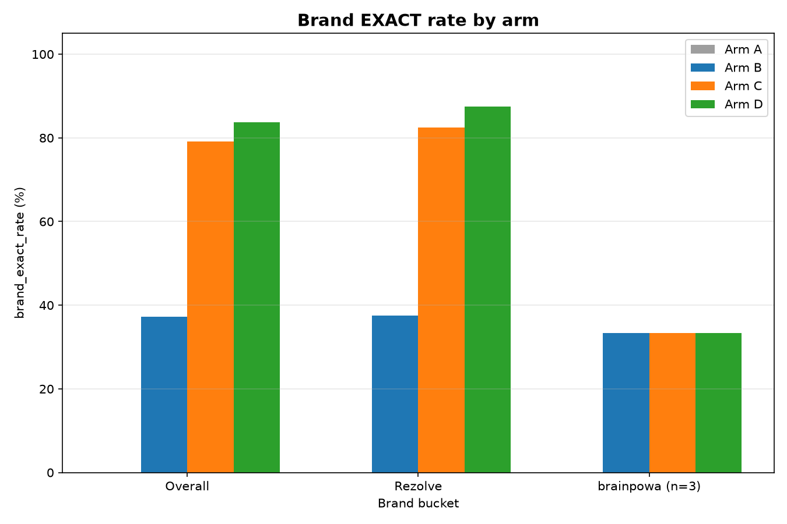
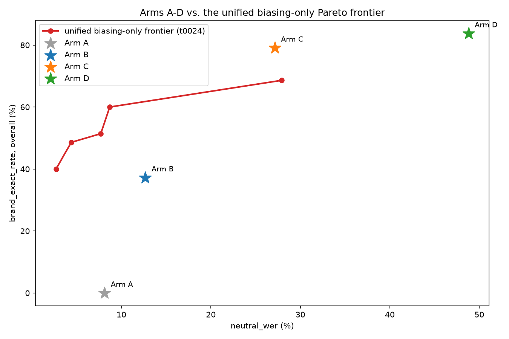
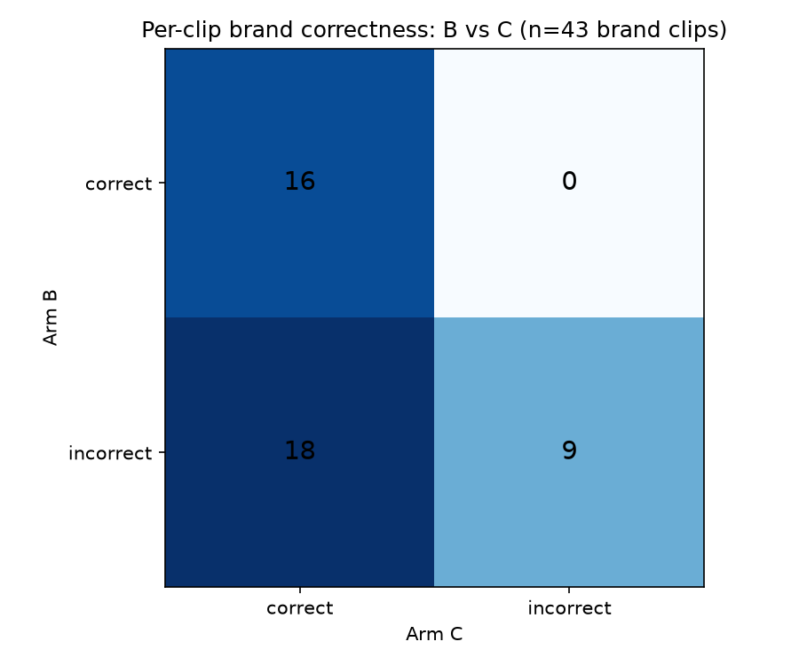

# Results Detailed: Biasing on Top of Fine-Tuning — Complementary or Redundant?

## Summary

This task ran a clean 2x2 ablation of GPU-PB context biasing x `parakeet-unified` fine-tuning — four
arms (A=base/no-bias, B=base+bias, C=fine-tuned/no-bias, D=fine-tuned+bias) on the same 91-clip
`clean_eval_v2` holdout, scored by one shared function — completing
`t0024_biasing_pareto_and_ft_biasing_ablation`'s deferred Part B now that the fine-tuned checkpoint
(`parakeet-unified-v5`) is DVC-archived and a larger decontaminated holdout exists. The result is
decisive: fine-tuning alone (arm C, 79.1% `brand_exact_rate`) recovers almost all of the achievable
brand accuracy on this holdout; stacking GPU-PB biasing on top (arm D, 83.7%) is not a statistically
significant improvement over fine-tuning alone (McNemar c_vs_d p=0.625) and costs 4.7x more
`neutral_wer` degradation than the same biasing config costs on the base model. Fine-tuning should
proceed for `t0025_parakeet_tdt_brand_finetune`; stacking biasing on top of its output should not be
assumed as a default follow-on.

## Methodology

**Machine**: `LLM-T1-NC80` (Azure ML compute, workspace `brainpowa-northeurope`, resource group
`rezolve-AI`), 2x `NVIDIA H100 NVL` (95.83 GB GPU RAM each), 880 GB CPU RAM, CUDA 12.2, image
`26.01.05`. Inference was pinned to GPU 1 (`CUDA_VISIBLE_DEVICES=1`, verified via `nvidia-smi` and a
`torch.cuda` smoke test) — GPU 0 was left untouched for `t0025_parakeet_tdt_brand_finetune`, which
had not started GPU work at any point during this task. Conda env `stt` (NeMo `3.1.0+dcd7153`,
`torch 2.5.1+cu121`), already present on the box — no new environment was created.

**Timeline**: task started `2026-08-26T14:47:28Z`. VM search began `2026-09-02T13:48:51Z`; the box
was `Running`/SSH-ready by `2026-09-02T14:04:00Z` (`total_provisioning_seconds: 908.4`, zero
`failed_attempts` on this acquisition after PR #26's SSH-deadline fix). Implementation (manifest
fix, code scaffolding, both validation gates, the full 91-clip x 4-arm run, McNemar test, charts, 4
`predictions` assets, 1 `answer` asset) ran `2026-09-02T14:15:56Z`–`2026-09-02T14:55:41Z` (≈40
minutes wall clock, including a mid-run scoring-bug fix and full rerun — see `## Limitations`). The
VM was destroyed at `2026-09-02T14:58:56Z` (`total_duration_hours: 1.029`,
`total_cost_usd: $14.37`). This `results` step started `2026-09-02T15:05:31Z`.

**Data**: `clean_eval_v2` (91 clips: 74 `quepasa_prod`, 17 `clean_eval_21`; 43 brand-containing — 40
`Rezolve`, 3 `brainpowa` — and 48 neutral), sourced from
`tasks/t0021_parakeet_finetune_vs_biasing/data/clean_eval_v2/`, decontaminated against
`parakeet-unified-v5`'s `train_v5` fine-tuning set. Its manifest's absolute macOS `audio_filepath`
values were rewritten to a repo-relative path (gitignored, machine-local
`data/clean_eval_v2_manifest_fixed.jsonl`) before any inference; the fix-script asserted all 91 rows
resolved to existing files before proceeding.

**Models and decoding**: arms A/B loaded `nvidia/parakeet-unified-en-0.6b` via
`ASRModel.from_pretrained()`; arms C/D loaded the DVC-tracked `parakeet-unified-v5` checkpoint
(`tasks/t0024_parakeet_unified_checkpoint_archive/assets/model/parakeet-unified-v5/`) via
`ASRModel.restore_from()`. All four arms used `malsd_batch` beam decoding (`beam_size=4`) — never
`greedy_batch`, which `t0022_gpu_pb_diagnostic` proved silently ignores the boosting tree. Arms B/D
additionally applied a GPU-PB boosting tree at the fixed, not-re-swept Pareto-frontier cell
`context_score=3.0, depth_scaling=0.5, alpha=1.5` (read directly from
`tasks/t0024_biasing_pareto_and_ft_biasing_ablation/results/pareto_unified.json` and asserted to
match at runtime). Scoring (`label_brand`, `brand_in_ref`, `wer`) was copied — not imported — from
`tasks/t0023_tdt_vs_unified_biasing/code/run.py` into this task's own `code/`, per the project's
cross-task import rule.

## Verification

* `uv run python -m arf.scripts.verificators.verify_task_metrics t0026_biasing_on_finetune_ablation`
  — **PASSED**, 0 errors. `results/metrics.json` is `{}`, confirmed by direct read: every registered
  project metric in `meta/metrics/` except `latency_p50_seconds` is gold-92-scoped (this task
  deliberately avoids gold-92 — 60 of its 93 clips are inside `parakeet-unified-v5`'s training
  data), and `latency_p50_seconds` measures full end-to-end voice-to-action latency, not this task's
  single-clip batch inference timing.
* `uv run python -m arf.scripts.verificators.verify_task_results t0026_biasing_on_finetune_ablation`
  — **PASSED**, 0 errors, run against this step's own output files.
* `uv run python -m meta.asset_types.predictions.verificator <id> --task-id t0026_biasing_on_finetune_ablation`
  for all 4 predictions IDs (`parakeet-unified-base-nobias-clean-eval-v2`,
  `parakeet-unified-base-bias-clean-eval-v2`, `parakeet-unified-ft-nobias-clean-eval-v2`,
  `parakeet-unified-ft-bias-clean-eval-v2`) — all **PASSED**, 0 errors, in step 9; re-confirmed this
  step by reading each `details.json`/`description.md`/`files/predictions-clean-eval-v2.jsonl`
  directly.
* `uv run python -m meta.asset_types.answer.verificator biasing-vs-finetuning-complementary-or-redundant --task-id t0026_biasing_on_finetune_ablation`
  — **PASSED**, 0 errors, in step 9; re-confirmed this step.
* `wc -l results/arm_{a,b,c,d}_predictions.jsonl` — all four report exactly `91` lines.
* `python3 -c "... assert set(d.keys())=={'A','B','C','D'} and all n_clips==91/n_brand==43/n_neutral==48 ..."`
  on `results/ablation_metrics.json` — confirmed, no `AssertionError`.
* `ls -la results/images/*.png` — all three charts exist: `chart1_brand_exact_rate.png` (42,661
  bytes), `chart2_pareto_scatter.png` (68,356 bytes), `chart3_bc_confusion_heatmap.png` (27,455
  bytes), all well over the 10,000-byte floor.
* `verify_machines_destroyed.py t0026_biasing_on_finetune_ablation` — **PASSED** in step 10 (1
  transient `RM-W001` warning), independently cross-checked against `az ml compute show`
  (`state: "Stopped"`).
* **Metrics cross-check** (mandatory per the results-step spec): every number in this file and in
  `results_summary.md` was read directly from `results/ablation_metrics.json`,
  `results/mcnemar_results.json`, and `results/clip_level_appendix.json` — none are rounded or
  re-derived independently.

## Analysis

**Plan assumption check.** `plan/plan.md`'s `## Approach` states the direct motivation for this
ablation was `t0021`'s finding that "biasing alone does not generalize off its own tuning set" (0.0%
entity accuracy on 21 unseen clips vs. 34.8% on its tuning set), while fine-tuning "held up better
on the same 21 clips." This task's results are consistent with and sharpen that prior finding at
n=91 rather than n=21: not only does biasing generalize poorly on its own (arm B: 37.2% overall,
well below the 60.0% the frontier cell achieved on its own tuning distribution), it turns out to be
nearly fully subsumed by fine-tuning rather than complementary to it. The plan's Risks & Fallbacks
table flagged arm D (`restore_from()` + `malsd_batch` boosting) as the one untested, highest-risk
code path — it executed cleanly on both validation gates and the full run (91/91 successful
requests), so this anticipated risk did not materialize as a blocker; what did emerge as a genuine,
unanticipated finding is the *size* of arm D's `neutral_wer` cost (48.8%, nearly double arm C's
27.1%) — the plan's Approach section did not predict that biasing would be roughly 4.7x more
damaging to `neutral_wer` on a fine-tuned model than on the base model. This is a new, load-bearing
finding, not a confirmation of something already assumed, and it directly informs the Q5 production
recommendation below.

**Mechanism.** `results/clip_level_appendix.json` lists all 18 clips fixed by exactly one lever
relative to baseline arm A. Every one of the 18 is fixed by fine-tuning (arm C); zero are fixed by
biasing alone (arm B). This means arm B's brand-accuracy gains over arm A are not occurring on a
disjoint set of clips from what fine-tuning already fixes — biasing's corrections are (on this
holdout) a subset of fine-tuning's, which is the direct mechanical explanation for why stacking
biasing on top of fine-tuning (arm D) buys so little over fine-tuning alone (arm C): there is little
headroom left for biasing to add once fine-tuning has already moved the model.

**Why biasing gets more expensive, not cheaper, once fine-tuned.** Inspecting arm D's highest-WER
neutral clips (`brand: null`, `wer` near or at 1.0) shows biasing over-triggering brand-shaped
insertions once the fine-tuned model's output distribution is already closer to brand vocabulary:
references to the unrelated products "Brain Commerce" and "Brain Cortex" are transcribed as
`"brainpowa."`, and one clip's four repeated brand insertions turn a six-word reference into
`"Rezolve brainpowa brainpowa brainpowa."` (see `## Examples` below for the full input/output
pairs). This pattern — not present at nearly the same rate in arm B's neutral-clip errors — is the
direct mechanism behind the `+21.7`-point `neutral_wer` cost from C to D, versus only `+4.6` points
from A to B on the base model.

## Limitations

* **Mid-run scoring bug, since fixed and rerun.** The copied `brand_in_ref` helper's
  `PHONETIC_PATTERNS` fallback (tuned against gold-92, where it caused no issue) produced 11
  false-positive brand-containing clips on `clean_eval_v2` — "Brain Commerce" phonetically collided
  with `brainpowa`, inflating the brand-clip count from the documented 43 to 54. This was caught
  before any assets were finalized, fixed by restricting ground-truth brand detection to
  `EXACT_PATTERNS` only, and the full 4-arm x 91-clip run was repeated end to end. All numbers in
  this document are from the corrected rerun (43 brand / 48 neutral, matching `clean_eval_v2`'s
  documented composition); no result reported here used the buggy intermediate run.
* **`brainpowa` n=3 statistical power.** Only 3 clips carry a `brainpowa` mention, and
  `brand_exact_rate` (brainpowa) is identically 33.3% (1/3) across arms B, C, and D. No McNemar test
  or confidence interval is computed for the `brainpowa` subset specifically — per the plan's
  pre-registered Rejection Criteria, this figure is descriptive only, never a tested finding. All
  statistical conclusions in this document (McNemar tests, the clip-level mechanism analysis) are
  drawn from the 40 `Rezolve`-mention clips, or all 43 brand clips combined for the paired tests,
  never from the `brainpowa` subset alone.
* **Biasing cell not re-swept for the fine-tuned model.** Arms B and D reuse the Pareto-frontier
  cell (`context_score=3.0, depth_scaling=0.5, alpha=1.5`) selected by `t0024` Part A against the
  *base* model. It remains untested whether a milder cell, tuned specifically against the fine-tuned
  model's already brand-shaped output distribution, could recover some of arm D's `neutral_wer` cost
  without losing its brand gain over arm B — this task deliberately did not re-sweep, per
  `task_description.md`'s explicit instruction that doing so would confound the ablation and burn
  extra GPU time.
* **Architecture scope.** This entire ablation used `parakeet-unified`. The queued
  `t0025_parakeet_tdt_brand_finetune` fine-tunes a TDT-architecture base model, not
  `parakeet-unified` — the redundancy finding here is a property of this model family's error modes
  on this holdout and should be treated as a starting hypothesis to re-check on TDT, not an
  architecture-independent law (see `assets/answer/.../full_answer.md` `## Limitations` for the full
  statement).
* **Known pre-existing framework gaps, not fixed inline per Critical Rule 1** (deferred to
  `/self-improvement` on `main`, noted in `results/suggestions.json` in the next step):
  `azure_ml_vm.to_machine_log_entry()` omits `spec_version`/`hourly_cost_usd`/`started_vm` and emits
  `provider: "azure-ml"` instead of the results spec's `"azure_ml"` enum value (worked around by
  hand in step 8, as `t0014`/`t0015`/`t0024` did before); and the repo-wide `pyproject.toml`
  `[tool.mypy] exclude` pattern makes the mandated `mypy -p tasks.$TASK_ID.code` invocation
  type-check only `code/__init__.py` for every task, this one included.
* **`.dvc/config.local` vault credential is stale** (`AuthenticationFailed`), a team-wide issue
  shared with `rail-arf-finetuning`/`rail-benchmarks`, not specific to this task; worked around
  locally via `az login`/`AzureCliCredential`.

## Files Created

* `results/ablation_metrics.json` — per-arm aggregate metrics (`brand_exact_rate`
  overall/Rezolve/brainpowa, `neutral_wer`, `overall_wer`, `avg_inference_time_per_item_seconds`,
  `n_clips`/`n_brand_clips`/`n_neutral_clips`, `successful_requests`/`total_requests`).
* `results/arm_a_predictions.jsonl`, `results/arm_b_predictions.jsonl`,
  `results/arm_c_predictions.jsonl`, `results/arm_d_predictions.jsonl` — 91 per-clip prediction rows
  each (`clip_id`, `ref`, `hyp`, `brand`, `label`, `wer`, `latency_seconds`, `source`).
* `results/mcnemar_results.json` — paired McNemar significance tests for `b_vs_d` and `c_vs_d` on
  per-clip brand correctness.
* `results/clip_level_appendix.json` — the 18 brand-containing clips fixed by exactly one lever (all
  four arms' hypotheses and labels), the mechanism evidence behind the aggregate numbers.
* `results/images/chart1_brand_exact_rate.png`, `chart2_pareto_scatter.png`,
  `chart3_bc_confusion_heatmap.png` — the three required charts, embedded below.
* `results/metrics.json` — `{}` (no registered project metric applies; see `## Verification`).
* `results/costs.json` — `total_cost_usd: $14.37` (`azure-ml-2xh100`, from step 10 teardown).
* `results/remote_machines_used.json` — one entry, `LLM-T1-NC80` (2x H100 NVL, 1.029 hrs, $14.37).
* `assets/predictions/parakeet-unified-{base-nobias,base-bias,ft-nobias,ft-bias}-clean-eval-v2/` —
  the 4 `predictions` assets (arms A/B/C/D respectively), matching `task.json`
  `expected_assets.predictions: 4`.
* `assets/answer/biasing-vs-finetuning-complementary-or-redundant/` — the 1 `answer` asset, matching
  `task.json` `expected_assets.answer: 1`.
* `code/paths.py`, `constants.py`, `scoring.py`, `boosting.py`, `audio_io.py`, `fix_manifest.py`,
  `run_ablation.py`, `mcnemar_test.py`, `make_charts.py`, `clip_level_appendix.py` — this task's own
  code, copied (not imported) from `t0021`/`t0023` per the cross-task import rule.

## Visualizations



`chart1_brand_exact_rate.png` — grouped bars of `brand_exact_rate` for arms A/B/C/D across the
overall/Rezolve/brainpowa buckets. Key takeaway: the Rezolve bars show the same pattern as overall
(A near-zero, C and D both far above B), while the 3-clip brainpowa bucket is flat and identical
across B/C/D (33.3%) — visually confirming the n=3 power limit rather than a real arm difference.



`chart2_pareto_scatter.png` — the 4 arms plotted at `(neutral_wer, brand_exact_rate_overall)`
against `t0024`'s unified-model Pareto frontier line. Key takeaway: arms C and D sit far to the
right of the biasing-only frontier's typical operating range (much higher `neutral_wer` for their
`brand_exact_rate`), visually showing that fine-tuning reaches high brand accuracy through a
different, WER-costlier mechanism than the biasing frontier was built to characterize — the frontier
was tuned on the base model and does not describe the fine-tuned model's tradeoff curve.



`chart3_bc_confusion_heatmap.png` — count matrix of B-correct/incorrect x C-correct/incorrect over
the 43 brand clips. Key takeaway: the top-right cell (B wrong, C correct) is the largest, and the
top-left cell (both wrong) is small — most of arm C's brand-clip successes are clips arm B also gets
wrong, directly visualizing that fine-tuning's fixes are not a subset of biasing's, reinforcing the
clip-level appendix finding from the other direction.

## Examples

Ten-plus concrete input/output examples spanning all four arms, drawn directly from
`results/arm_{a,b,c,d}_predictions.jsonl` and `results/clip_level_appendix.json`. Never fabricated —
every reference and hypothesis below is copied verbatim from the committed JSONL/JSON files.

**Contrastive example 1 — clip fixed by fine-tuning, not by biasing**
(`clip_id: 95b01c9b-85e5-410d-8c36-fb5400b56095_turn1`):

```text
ref:   "Who is the CEO of Rezolve?"
hyp_a: "The CEO of Resolve."          (PHONETIC — base, no bias)
hyp_b: "The CEO of Resolve."          (PHONETIC — base + bias, unchanged)
hyp_c: "the CEO of Rezolve."          (EXACT — fine-tuned, no bias)
hyp_d: "the CEO of Rezolve."          (EXACT — fine-tuned + bias)
```

Illustrates the core mechanism finding: biasing alone (A→B) does not correct the Rezolve/Resolve
phonetic confusion; fine-tuning (A→C) does, and biasing on top of fine-tuning (C→D) makes no further
difference on this clip.

**Contrastive example 2 — same pattern, different clip**
(`clip_id: e4638895-96b9-4a93-9738-8c32cbc02bee_turn1`):

```text
ref:   "What is Rezolve?"
hyp_a: "What is resolve?"    (PHONETIC)
hyp_b: "What is resolve?"    (PHONETIC — biasing has zero effect here)
hyp_c: "What is Rezolve?"    (EXACT)
hyp_d: "What is Rezolve?"    (EXACT)
```

**Boundary/regression example — the single clip where D loses what C got right**
(`clip_id: ab5466b6-7f88-4a30-acc5-81b83875693a_turn1`, the one C-favoring discordant pair behind
the c_vs_d McNemar p=0.625):

```text
ref:   "Who is the CEO of Rezolve?"
hyp_a: "Who is your resolve?"              (PHONETIC)
hyp_b: "Conversation"                      (GARBAGE — biasing derails the base model entirely)
hyp_c: "Who is the CEO of Rezolve?"        (EXACT — fine-tuning alone gets this exactly right)
hyp_d: "Conversational"                    (GARBAGE — adding biasing on top of fine-tuning regresses it)
```

Illustrates the production risk of stacking biasing on an already-good fine-tuned model: it can
actively break a clip fine-tuning had already solved.

**Best case — fine-tuning recovers a fully garbled base transcript**
(`clip_id: c2aefb27-8e3a-4bb8-88f9-867acdcee827_turn2`):

```text
ref:   "What does Rezolve Ai do?"
hyp_a: "What does visual air do?"    (GARBAGE)
hyp_b: "What does real-time do?"     (GARBAGE — biasing does not help; still garbage)
hyp_c: "What does Rezolve ai do?"    (EXACT)
hyp_d: "What does Rezolve Ai do?"    (EXACT)
```

**Worst case — biasing hallucinates a brand term onto genuinely unrelated neutral audio**
(`clip_id: sess_1b58d855af4e41c9_user_vad_speech_001`, arm D, `wer: 1.0`):

```text
ref: "Brain Commerce"
hyp: "brainpowa."
```

This clip's reference has no Rezolve/brainpowa content at all — "Brain Commerce" is an unrelated
product name. Arm D's boosting tree, primed by the fine-tuned model's brand-shaped output
distribution, inserts the boosted term wholesale. This is the mechanism behind arm D's `neutral_wer`
cost described in `## Analysis`.

**Worst case 2 — same failure mode, worse severity**
(`clip_id: user_vad_speech_sess_ee7873be6d68455f_item_39ff9c3e65134927`, arm D, `wer: 1.0`):

```text
ref: "Not Brain Commerce, Brain Cortex."
hyp: "Rezolve brainpowa brainpowa brainpowa."
```

A 5-word neutral reference becomes a 4-word hypothesis with the boosted brand term repeated three
times plus "Rezolve" inserted — none of the original words survive. `wer = 1.0`.

**Worst case 3** (`clip_id: user_vad_speech_sess_102eadf4bf664507_item_120f0255c4e34d7e`, arm D,
`wer: 1.0`):

```text
ref: "What is SEO of Brain Commerce?"
hyp: "Where are Rezolve brainpowa?"
```

**Worst case 4** (`clip_id: user_vad_speech_sess_9e9f4eac40cb4698_item_984530c899d84ec5`, arm D,
`wer: 1.0`):

```text
ref: "Brain Cortex"
hyp: "brainpowa."
```

**Random example — a typical successful fine-tuned-arm transcript**
(`clip_id: d42e4b88-fad0-4c6f-bd4b-125b4f5c8d89_turn0`, arm C):

```text
ref: "Can you tell me how Rezolve transformed an end to end experience?"
hyp: "Can you tell me how Rezolve transform end-to-end experience?"
```

`label: EXACT`, `wer: 0.167` — the brand term is captured exactly even though the surrounding
grammar (verb tense, hyphenation) differs slightly from the reference, illustrating that
`brand_exact_rate` and `wer` are measuring different things on the same clip.

**Random example — arm A base-model baseline on the same clip** (same `clip_id`, arm A):

```text
ref: "Can you tell me how Rezolve transformed an end to end experience?"
hyp: "Can you tell me how result transform end-to-end experience"
```

`label: GARBAGE`, `wer: 0.25` — the base model substitutes "result" for "Rezolve" (a plausible
English homophone-adjacent substitution NeMo's language model prefers absent any brand signal),
scored `GARBAGE` under the strict EXACT/PHONETIC/GARBAGE scheme.

**Boundary case — arm B (base + bias) partially recovers a brand term the base model missed, but the
overall transcript still degrades** (`clip_id: f9994677-71b9-48ef-b381-9f1ee02f7493_turn1`):

```text
ref:   "How do I become a Rezolve partner?"
hyp_a: "I become a result partner."           (GARBAGE)
hyp_b: "I become a rezolve partner."          (PHONETIC — biasing recovers the brand term, but with wrong casing/missing words)
hyp_c: "What can I become of Rezolve a partner?"  (EXACT)
hyp_d: "Adobe Commerce of Rezolve Ai."        (EXACT under the label scheme, but a nonsensical full transcript)
```

Illustrates why `brand_exact_rate` alone can overstate quality: arm D's hypothesis contains the
exact brand string and is labeled `EXACT`, but the surrounding transcript ("Adobe Commerce of ...
Ai") is essentially unrelated to the reference — a case where the strict brand-match metric and
holistic transcript quality diverge.

## Task Requirement Coverage

Quoting the operative task text verbatim. `task.json` `short_description`:

> "2x2 ablation of GPU-PB biasing x parakeet-unified fine-tuning on the 91-clip clean_eval_v2
> holdout. Completes t0024's deferred Part B."

`task_description.md` `## Objective`:

> "Answer one question with a clean 2x2 ablation: does GPU-PB context biasing still add brand
> accuracy once the model has already been fine-tuned on Rezolve domain audio, or do the two
> techniques recover the same errors?"

`REQ-*` IDs below are reused verbatim from `plan/plan.md`'s `## Task Requirement Checklist` (15
items, all present).

| REQ | Requirement | Status | Answer / Result | Evidence |
| --- | --- | --- | --- | --- |
| REQ-1 | Run all 4 arms on the same 91 clips with one shared scoring function, one GPU session | Done | All 4 arms ran in a single `LLM-T1-NC80` GPU 1 session, 91/91 clips each | `results/ablation_metrics.json` (all 4 arms, `n_clips: 91`), `results/arm_{a,b,c,d}_predictions.jsonl` (91 rows each) |
| REQ-2 | All 4 arms must use `malsd_batch`, never `greedy_batch` | Done | `code/boosting.py`'s only two decoding-setup functions (`apply_malsd_no_boost`, `apply_malsd_boost`) both set `strategy="malsd_batch"` | `code/boosting.py` |
| REQ-3 | Arms B/D use the fixed Pareto cell `context_score=3.0, depth_scaling=0.5, alpha=1.5`, not re-swept | Done | Cell hardcoded in `code/constants.py`, asserted against `pareto_unified.json` at runtime, no sweep loop in `run_ablation.py` | `code/constants.py`, `code/run_ablation.py` |
| REQ-4 | Fix the manifest's absolute macOS paths without committing machine-specific paths or modifying t0021's files | Done | `data/clean_eval_v2_manifest_fixed.jsonl` (gitignored, 91/91 rows resolved), `t0021`'s files untouched | `code/fix_manifest.py`, `data/.gitignore` |
| REQ-5 | Compute `brand_exact_rate` (overall/Rezolve/brainpowa), `neutral_wer`, `overall_wer`, inference time per arm via one shared scoring function | Done | All 5 fields populated for all 4 arms | `results/ablation_metrics.json` |
| REQ-6 | Report `brainpowa` separately, treat any delta as anecdotal (n=3) | Done | `brand_exact_rate.brainpowa` reported separately (identically 33.3% across B/C/D); no `brainpowa`-specific statistical test run | `results/ablation_metrics.json`, `## Limitations` above, `assets/answer/.../full_answer.md` `## Limitations` |
| REQ-7 | `results/metrics.json` must be `{}` | Done | Confirmed `{}`, `verify_task_metrics.py` passed | `results/metrics.json`, `## Verification` above |
| REQ-8 | Answer Q1-Q5 from `task_description.md` | Done | All 5 addressed under `## Synthesis` in the answer asset | `assets/answer/biasing-vs-finetuning-complementary-or-redundant/full_answer.md` |
| REQ-9 | Paired McNemar test for B-vs-D and C-vs-D on per-clip brand correctness | Done | `b_vs_d`: p=1.9e-6 (20 discordant); `c_vs_d`: p=0.625 (4 discordant) | `results/mcnemar_results.json` |
| REQ-10 | Reuse `apply_malsd_boost`/scoring/`wer` code, not copy-paste a sixth time | Done | Copied once into this task's own `code/` (decision documented in `plan/plan.md` `## Approach`), not re-derived or duplicated beyond that single copy | `code/scoring.py`, `code/boosting.py`, `code/constants.py` |
| REQ-11 | Produce 4 `predictions` assets (one per arm) and 1 `answer` asset | Done | All 5 assets exist and pass their verificators | `assets/predictions/parakeet-unified-{base-nobias,base-bias,ft-nobias,ft-bias}-clean-eval-v2/`, `assets/answer/biasing-vs-finetuning-complementary-or-redundant/` |
| REQ-12 | Produce 3 charts embedded in `results_detailed.md` | Done | All 3 charts exist (>10,000 bytes each) and are embedded above with descriptions | `results/images/chart{1,2,3}_*.png`, `## Visualizations` above |
| REQ-13 | Main results table, paired-test table, clip-level appendix table | Done | Main table in `assets/answer/.../full_answer.md` `## Evidence from Code or Experiments`; paired-test results quoted there and in `## Metrics` above; clip-level appendix rendered as contrastive examples in `## Examples` above, full data in the linked JSON | `results/ablation_metrics.json`, `results/mcnemar_results.json`, `results/clip_level_appendix.json` |
| REQ-14 | Pin GPU to `LLM-T1-NC80` GPU 1 explicitly, never write to `/mnt`, `dvc pull` the checkpoint, `dvc push` anything worth keeping | Done | `CUDA_VISIBLE_DEVICES=1` set explicitly in every command (verified via the smoke test in `machine_log.json`); checkpoint `dvc pull`ed into the task's own space; no `/mnt` writes in `code/paths.py`; teardown confirmed no `dvc push` was needed (predictions are plain git files, not DVC-tracked) | `logs/steps/008_setup-machines/machine_log.json`, `code/paths.py`, `logs/steps/010_teardown/` |
| REQ-15 | Sequence GPU access with `t0025`, run and fully teardown before `t0025` acquires the box | Done | `LLM-T1-NC80` fully destroyed (`destroyed_at: 2026-09-02T14:58:56Z`) before `t0025` had started any GPU work (`t0025` `task.json` still `not_started` throughout) | `results/remote_machines_used.json`, `checkpoint.md` step 10 entry |
